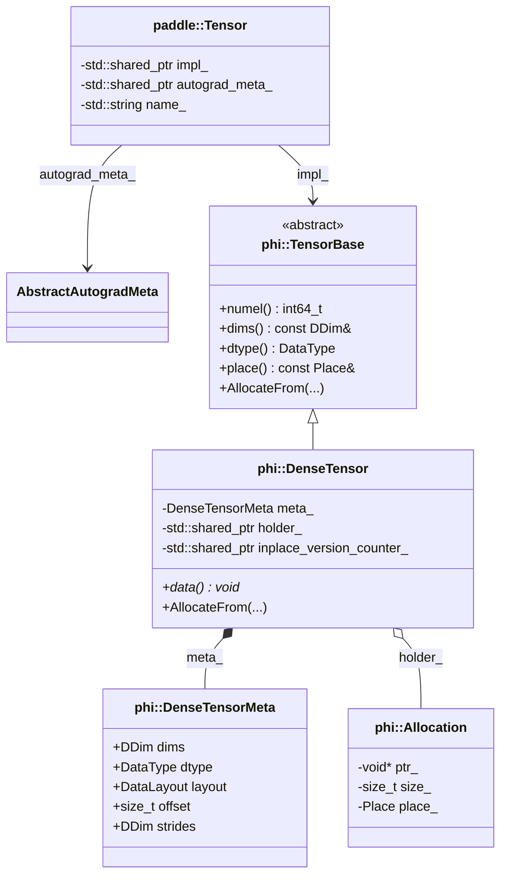

# Paddle Tensor 内存设计学习文档

本文档结合 Paddle 源码，梳理 `paddle::Tensor` 在常见 dense tensor 路径下的内存设计。重点回答三个问题：

1. `paddle::Tensor` 自己到底持有什么。
2. 真正的数据缓冲区由谁管理。
3. 张量拷贝、共享、view、inplace version 分别落在哪一层。

> **Note**: 本文档主要参考 `/home/may/Paddle/paddle/phi/api/include/tensor.h`、`/home/may/Paddle/paddle/phi/api/lib/tensor.cc`、`/home/may/Paddle/paddle/phi/core/tensor_base.h`、`/home/may/Paddle/paddle/phi/core/dense_tensor.h`、`/home/may/Paddle/paddle/phi/core/dense_tensor.cc`、`/home/may/Paddle/paddle/phi/core/dense_tensor_impl.cc`、`/home/may/Paddle/paddle/phi/core/tensor_meta.h`。

---

## 1. 整体架构概览

`paddle::Tensor` 不是“直接持有一块内存的张量对象”，它更像一个 API 层句柄。对 dense tensor 来说，真实的数据和元数据主要落在 `phi::DenseTensor` 上。

### 1.1 核心组件关系图



### 1.2 一句话理解

| 层级 | 作用 |
|------|------|
| `paddle::Tensor` | 面向 API 的统一句柄，负责把不同底层 tensor 实现包装成一个类型 |
| `phi::TensorBase` | 底层抽象接口，定义 `numel/dims/dtype/place/AllocateFrom` 等基本能力 |
| `phi::DenseTensor` | dense tensor 的核心实现，持有元数据和内存 holder |
| `phi::Allocation` | 真正描述底层 buffer 的对象，保存 `ptr/size/place` |

一个关键结论是：**Paddle 的 Tensor 包装层和内存层是分开的**。理解这点以后，很多行为都好解释了。

---

## 2. `paddle::Tensor` 自己持有什么

### 2.1 `Tensor` 是一个轻量句柄

`tensor.h` 对 `paddle::Tensor` 的注释写得很直接：

```cpp
class PADDLE_API Tensor final {
 private:
  std::shared_ptr<phi::TensorBase> impl_{nullptr};
  std::shared_ptr<AbstractAutogradMeta> autograd_meta_{nullptr};
  std::string name_{""};
};
```

这里最重要的是 `impl_`：

- `paddle::Tensor` 本身不直接保存原始数据指针。
- 它通过 `std::shared_ptr<phi::TensorBase>` 指向真正的底层实现。
- 这意味着 `Tensor` 的默认拷贝语义天然是浅拷贝，多个 `Tensor` 可以共享同一个底层 `TensorBase`。

`tensor.h` 里还有一段解释为什么 `autograd_meta_` 不放在 `TensorImpl` 里：

- `AutogradMeta` 是动态图执行信息，不是 tensor 数据描述本身。
- kernel 计算不依赖它。
- 所以 Paddle 把它放在 `paddle::Tensor` 这一层，而不是 `phi::TensorBase` / `phi::DenseTensor` 里。

这和 PyTorch 很不一样，后者把 autograd 相关挂在 `TensorImpl` 上。

### 2.2 `TensorBase` 是统一底座

`phi::TensorBase` 只是接口，不关心具体内存布局：

```cpp
class TensorBase {
 public:
  virtual int64_t numel() const = 0;
  virtual const DDim& dims() const = 0;
  virtual DataType dtype() const = 0;
  virtual const Place& place() const = 0;
  virtual bool has_allocation() const = 0;
  virtual bool initialized() const = 0;
  virtual void* AllocateFrom(Allocator* allocator,
                             DataType dtype,
                             size_t requested_size = 0,
                             bool fake_alloc = false) = 0;
};
```

因此 `paddle::Tensor` 可以统一包装：

- `phi::DenseTensor`
- `phi::distributed::DistTensor`
- `phi::SelectedRows`
- 稀疏 tensor

但本文讨论“内存设计”时，主线主要是 `phi::DenseTensor`。

---

## 3. 真正的 dense 内存由谁管理

### 3.1 `DenseTensor` 同时持有元数据和 holder

`phi::DenseTensor` 是 dense 路径上的核心对象：

```cpp
class PADDLE_API DenseTensor : public TensorBase {
 public:
  const DenseTensorMeta& meta() const noexcept { return meta_; }
  bool initialized() const override { return holder_ && holder_->ptr(); }
  bool has_allocation() const override { return holder_ != nullptr; }
  size_t capacity() const { return holder_->size(); }
  const std::shared_ptr<phi::Allocation>& Holder() const { return holder_; }

 protected:
  DenseTensorMeta meta_;
  std::shared_ptr<phi::Allocation> holder_;
};
```

也就是说：

- `meta_` 负责描述“这个 tensor 看起来是什么样”。
- `holder_` 负责描述“底层 buffer 在哪儿”。

这是一种典型的“元数据 + 存储句柄”拆分设计。

### 3.2 `DenseTensorMeta` 描述 view 信息

`DenseTensorMeta` 的字段非常关键：

```cpp
struct DenseTensorMeta {
  bool is_scalar{false};
  bool use_gpudnn{true};
  DDim dims;
  DataType dtype{DataType::UNDEFINED};
  DataLayout layout{DataLayout::NCHW};
  LegacyLoD legacy_lod;
  size_t offset{0};
  DDim strides;
};
```

对内存设计最关键的是这几个字段：

- `dims`：逻辑形状。
- `dtype`：元素类型。
- `offset`：相对 `holder_->ptr()` 的偏移。
- `strides`：步长信息。

所以 Paddle 对 dense tensor 的“view 语义”，主要就是通过 `meta_.offset + meta_.strides + meta_.dims` 来表达，而不是把这些信息拆到单独的 storage 对象上。

这里有一个很容易忽略的细节：

- `DenseTensorMeta::offset` 是**字节偏移**。
- 因为 `DenseTensor::data()` 里直接做的是指针字节加法。

### 3.3 `phi::Allocation` 才是真正的 buffer 持有者

`phi::Allocation` 的核心字段是：

```cpp
class Allocation {
 protected:
  void* ptr_{nullptr};
  size_t size_{};
  DeleterFnPtr deleter_{nullptr};
  Place place_;
};
```

也就是说，最底层的 buffer 信息是：

- `ptr_`：原始地址
- `size_`：buffer 大小
- `place_`：设备位置

`DenseTensor` 只是通过 `std::shared_ptr<phi::Allocation>` 持有它。

---

## 4. 分配路径：从 `Tensor::mutable_data()` 到 `Allocation`

### 4.1 `paddle::Tensor` 只是把请求转发给 `DenseTensor`

`tensor.cc` 中的 `mutable_data<T>()` 基本没有自己的存储逻辑：

```cpp
template <typename T>
T* Tensor::mutable_data() {
  if (is_dense_tensor()) {
    return static_cast<phi::DenseTensor*>(impl_.get())->mutable_data<T>(place());
  }
  return nullptr;
}
```

这里能看出两件事：

1. `paddle::Tensor` 只是入口。
2. 真正的分配逻辑在 `phi::DenseTensor` 里。

### 4.2 `DenseTensor::AllocateFrom()` 决定是否真正申请内存

`dense_tensor.cc` 的核心逻辑是：

```cpp
void* DenseTensor::AllocateFrom(Allocator* allocator,
                                DataType dtype,
                                size_t requested_size,
                                bool fake_alloc) {
  if (this->dtype() != dtype) {
    meta_.dtype = dtype;
  }

  size_t bytes = numel() * SizeOf(this->dtype());

  if (!holder_ || holder_->size() < bytes + meta_.offset) {
    meta_.offset = 0;
    auto holder = allocator->Allocate(bytes);
    holder_ = std::move(holder);
  }

  uintptr_t ptr = reinterpret_cast<uintptr_t>(holder_->ptr()) + meta_.offset;
  return reinterpret_cast<void*>(ptr);
}
```

这段代码揭示了 Paddle dense tensor 的几个核心规则：

1. 申请大小默认由 `numel() * SizeOf(dtype)` 算出。
2. 如果当前没有 `holder_`，或者现有容量不够，就重新分配。
3. 一旦重分配，`meta_.offset` 会被清零。
4. 返回给上层的地址不是 `holder_->ptr()`，而是 `holder_->ptr() + meta_.offset`。

### 4.3 Paddle 同时支持“立即分配”和“延迟分配”

`DenseTensor` 有两类典型构造方式：

```cpp
DenseTensor(Allocator* a, const DenseTensorMeta& meta)
    : meta_(meta), holder_(a->Allocate(SizeOf(dtype()) * numel())) {}

DenseTensor();
```

结合 `dense_tensor.cc` 的注释可以看出：

- 如果你用带 `Allocator*` 的构造函数，tensor 创建时就会拿到 `holder_`。
- 如果你走默认构造或旧路径，则可能在第一次 `mutable_data()` / `AllocateFrom()` 时才真正分配。

也就是说，Paddle dense tensor 既保留了“创建即分配”的新式路径，也兼容了“先有 meta，后分配内存”的历史路径。

---

## 5. 取数路径：为什么 `data()` 会带 offset

`DenseTensor::data()` 的实现很直接：

```cpp
void* DenseTensor::data() {
  uintptr_t ptr = reinterpret_cast<uintptr_t>(holder_->ptr()) + meta_.offset;
  return reinterpret_cast<void*>(ptr);
}

const void* DenseTensor::data() const {
  uintptr_t ptr = reinterpret_cast<uintptr_t>(holder_->ptr()) + meta_.offset;
  return reinterpret_cast<const void*>(ptr);
}
```

这说明 Paddle 的 dense tensor 取数地址由两部分组成：

- `holder_->ptr()`：底层 buffer 起点
- `meta_.offset`：当前 tensor 视图在 buffer 中的起始字节偏移

所以从内存设计上说，一个 `DenseTensor` 不是简单等于“一块独占内存”，而是：

- 共享一个 `holder_`
- 再用 `meta_` 描述当前视图应该如何解释这块内存

这也是 `strides` 和 `offset` 存在的根本原因。

---

## 6. 拷贝、共享与 view 语义

### 6.1 `paddle::Tensor` 的拷贝是句柄级浅拷贝

`paddle::Tensor` 的拷贝构造和拷贝赋值都使用默认实现，这意味着：

- `impl_` 这个 `shared_ptr` 会被共享。
- `autograd_meta_` 这个 `shared_ptr` 也会被共享。

所以 `Tensor a = b;` 的成本主要是共享智能指针，而不是复制数据。

### 6.2 `DenseTensor` 的拷贝同样是浅拷贝

`dense_tensor.cc` 的拷贝构造更清楚：

```cpp
DenseTensor::DenseTensor(const DenseTensor& other) {
  this->meta_ = other.meta();
  holder_ = other.holder_;
  storage_properties_ = CopyStorageProperties(other.storage_properties_);
  inplace_version_counter_ = other.inplace_version_counter_;
}
```

这表示一次普通的 `DenseTensor` 拷贝会共享：

- `holder_`
- `inplace_version_counter_`

因此这类拷贝的语义很接近“两个 tensor 包装同一份底层状态”。

### 6.3 `ShareDataWith()` 共享 buffer，但不自动共享 version counter

`dense_tensor_impl.cc` 里 `ShareDataWith()` 的实现是：

```cpp
DenseTensor& DenseTensor::ShareDataWith(const DenseTensor& src) {
  holder_ = src.holder_;
  meta_.dims = src.meta_.dims;
  meta_.dtype = src.meta_.dtype;
  meta_.layout = src.meta_.layout;
  meta_.offset = src.meta_.offset;
  meta_.strides = src.meta_.strides;
  storage_properties_ = CopyStorageProperties(src.storage_properties_);
  return *this;
}
```

注意这里**没有**同步 `inplace_version_counter_`。

这正好对应 `dense_tensor.h` 里的注释：

- 普通拷贝的 `DenseTensor` 会共享 version counter。
- 但 `ShareDataWith(...)` / `ShareBufferWith(...)` 这种“共享 Allocation、替换数据来源”的路径，不默认共享 version counter。

如果确实需要共享版本计数，Paddle 提供了单独的：

```cpp
DenseTensor& DenseTensor::ShareInplaceVersionCounterWith(
    const DenseTensor& src)
```

这个设计说明 Paddle 把“共享底层 buffer”和“共享版本语义”刻意区分开了。

### 6.4 `contiguous()` 不是只改标志位，可能直接生成新 tensor

`tensor.cc` 里的逻辑是：

```cpp
if (!dense_tensor->meta().is_contiguous()) {
  auto new_dense_tensor = std::make_shared<phi::DenseTensor>();
  *new_dense_tensor = paddle::experimental::Trans2Contiguous(*dense_tensor);
  return Tensor(std::shared_ptr<phi::TensorBase>(new_dense_tensor),
                autograd_meta_,
                name_);
} else {
  return *this;
}
```

这说明在 Paddle 里：

- contiguous 与否由 `meta().is_contiguous()` 判断。
- 如果不是 contiguous，常见做法是直接物化一个新的连续内存 tensor。

---

## 7. Autograd 与 inplace version 放在哪一层

### 7.1 AutogradMeta 在 `paddle::Tensor` 层

Paddle 明确把 autograd 信息放在 API 包装层：

```cpp
std::shared_ptr<AbstractAutogradMeta> autograd_meta_{nullptr};
```

这背后的设计意图是：

- `phi::TensorBase` / `phi::DenseTensor` 专注数据描述与 kernel 计算。
- `autograd_meta_` 属于动态图执行信息，不属于纯粹的张量内存结构。

### 7.2 inplace version 在 `DenseTensor` 层

`dense_tensor.h` 中的定义是：

```cpp
class InplaceVersion {
 public:
  void Bump() { ++inplace_version_; }
  uint32_t CurrentVersion() const { return inplace_version_; }
};

std::shared_ptr<InplaceVersion> inplace_version_counter_ =
    std::make_shared<InplaceVersion>();
```

源码注释还专门解释了为什么它不放在 `Allocation` 里：

- `Allocation` 可能被替换或重置。
- 如果 version counter 绑在 `Allocation` 上，语义会变乱。

因此，Paddle 的分层可以概括成：

- 数据 buffer 所有权：`phi::Allocation`
- 视图元数据：`DenseTensorMeta`
- inplace version：`phi::DenseTensor`
- autograd 信息：`paddle::Tensor`

这个分布和 PyTorch 不同，Paddle 的职责拆分更“分层化”。

---

## 8. 理解 Paddle Tensor 内存设计的三个抓手

### 8.1 抓手一：`Tensor` 只是壳

遇到 `paddle::Tensor` 时，先别把它当成“内存本体”。它更像是一个统一句柄：

- API 行为在这一层暴露。
- 真实内存状态在 `impl_` 里。

### 8.2 抓手二：dense 路径看 `DenseTensor`

只要问题是“内存在哪、shape/stride 在哪、offset 怎么算”，就应该直接看：

- `phi::DenseTensor`
- `phi::DenseTensorMeta`
- `phi::Allocation`

### 8.3 抓手三：Paddle 把“数据共享”和“版本共享”分开处理

这是最容易和 PyTorch 混淆的地方：

- 共享 `holder_` 不等于共享 `inplace_version_counter_`
- `ShareDataWith()` 不自动等于 view 语义
- 需要共享 version 时要显式走对应接口

---

## 9. 总结

Paddle dense tensor 的内存设计可以概括成一句话：

**`paddle::Tensor` 负责统一包装，`phi::DenseTensor` 负责描述 dense 视图，`phi::Allocation` 负责真正持有底层 buffer。**

如果再压缩一点，可以记成下面这条链：

```text
paddle::Tensor
  -> shared_ptr<phi::TensorBase>
  -> phi::DenseTensor
  -> shared_ptr<phi::Allocation>
  -> raw memory
```

而 dense view 的核心不在一个独立 `Storage` 对象里，而在：

```text
holder_ + meta_.dims + meta_.strides + meta_.offset
```

这也是 Paddle Tensor 内存设计最核心的阅读入口。
