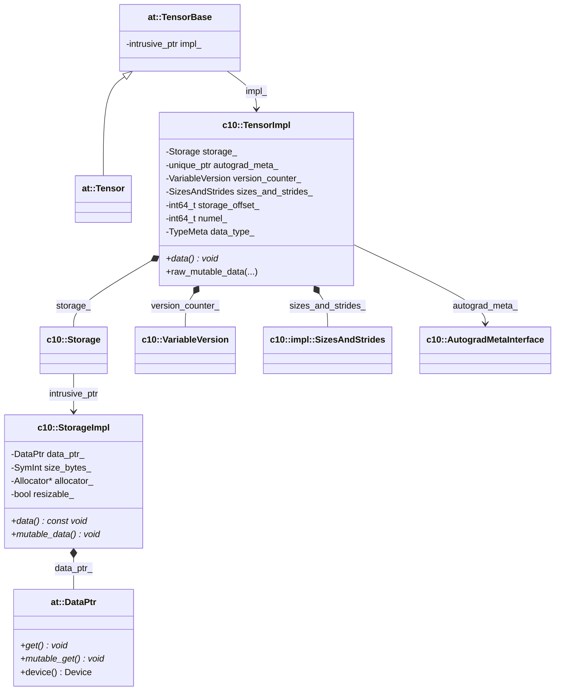

# Torch Tensor 内存设计学习文档

本文档结合 PyTorch 源码，梳理 `at::Tensor` 的内存设计。重点关注 strided/dense tensor 的主路径，也就是平时最常见的 CPU/CUDA dense 张量实现。

本文档重点回答四个问题：

1. `at::Tensor` 本身持有什么。
2. `TensorImpl` 和 `StorageImpl` 如何分工。
3. view / offset / stride 为什么能共享同一块底层内存。
4. version counter 与 autograd 信息为什么放在 `TensorImpl` 上。

> **Note**: 本文档主要参考 `/home/may/pytorch/aten/src/ATen/templates/TensorBody.h`、`/home/may/pytorch/aten/src/ATen/core/TensorBase.h`、`/home/may/pytorch/c10/core/TensorImpl.h`、`/home/may/pytorch/c10/core/StorageImpl.h`。

---

## 1. 整体架构概览

PyTorch 的 tensor 内存设计最核心的特点是：**view 元数据和底层 storage 被显式拆成两层。**

### 1.1 核心组件关系图



### 1.2 一句话理解

| 层级 | 作用 |
|------|------|
| `at::Tensor` / `TensorBase` | 用户可见句柄，负责引用计数地持有 `TensorImpl` |
| `TensorImpl` | 描述“这个 tensor 视图长什么样”，并持有 storage 句柄 |
| `StorageImpl` | 持有真正的底层 buffer 和 allocator 信息 |
| `DataPtr` | 最底层的数据指针对象，连同 deleter / context / device 一起封装 |

PyTorch 的设计重点不是“一个 tensor 独占一块内存”，而是：

- 一个 `StorageImpl` 可以被多个 `TensorImpl` 共享。
- 每个 `TensorImpl` 再用各自的 `sizes/strides/storage_offset` 描述不同 view。

---

## 2. `at::Tensor` 本身是什么

### 2.1 `Tensor` 是对 `TensorImpl` 的引用计数句柄

`TensorBody.h` 对这件事写得很清楚：

```cpp
// Tensor is a "generic" object holding a pointer to the underlying TensorImpl object,
// which has an embedded reference count.
class TORCH_API Tensor : public TensorBase {
 public:
  explicit Tensor(
      c10::intrusive_ptr<TensorImpl, UndefinedTensorImpl> tensor_impl)
      : TensorBase(std::move(tensor_impl)) {}
};
```

`TensorBase.h` 也明确说明：

```cpp
// TensorBase represents a reference counted handle to TensorImpl, exactly the
// same as Tensor.
class TORCH_API TensorBase {
 protected:
  c10::intrusive_ptr<at::TensorImpl, UndefinedTensorImpl> impl_;
};
```

这意味着：

- `Tensor a = b;` 不会复制数据。
- 它只是让两个 `Tensor` 共享同一个 `TensorImpl`。
- 引用计数不是 `shared_ptr`，而是 `intrusive_ptr`。

所以 PyTorch 的第一层共享单位其实是 `TensorImpl`。

---

## 3. `TensorImpl` 才是内存语义的核心

### 3.1 源码对 `TensorImpl` 的定义已经直接点题

`TensorImpl.h` 有一段非常关键的说明：

```cpp
/**
 * The low-level representation of a tensor, which contains a pointer
 * to a storage (which contains the actual data) and metadata
 * (e.g., sizes and strides) describing this particular view of the data.
 */
```

接着它继续说明：

- tensor 里有一个指向 storage 的指针
- tensor 自己记录 sizes、strides、offset 这类 view 元数据
- 多个 tensor 可以 alias 同一个 storage

这其实就是 PyTorch view 机制的核心。

### 3.2 `TensorImpl` 的关键字段

`TensorImpl` 内部最值得记住的字段是：

```cpp
protected:
  Storage storage_;

private:
  std::unique_ptr<c10::AutogradMetaInterface> autograd_meta_ = nullptr;
  std::unique_ptr<c10::ExtraMeta> extra_meta_ = nullptr;
  c10::VariableVersion version_counter_;
  c10::impl::SizesAndStrides sizes_and_strides_;
  int64_t storage_offset_ = 0;
  int64_t numel_ = 1;
  caffe2::TypeMeta data_type_;
  std::optional<c10::Device> device_opt_;
```

可以按职责分成三组来看：

1. 底层存储句柄：
   `storage_`
2. 当前 view 的元数据：
   `sizes_and_strides_`、`storage_offset_`、`numel_`、`data_type_`
3. 自动求导和版本语义：
   `autograd_meta_`、`version_counter_`

### 3.3 `storage_offset_` 是按“元素”计，不是按字节计

`TensorImpl.h` 里写得很明确：

```cpp
/**
 * Return the offset in number of elements into the storage
 * that this tensor points to.
 *
 * WARNING: This is NOT computed in bytes.
 */
int64_t storage_offset() const {
  return storage_offset_;
}
```

这点非常重要，因为它和 Paddle 的 dense 路径不同：

- PyTorch `storage_offset_` 是元素偏移。
- Paddle `DenseTensorMeta::offset` 是字节偏移。

这直接影响 `data()` 地址计算方式。

---

## 4. `StorageImpl` 才是真正的 buffer 所有者

### 4.1 `StorageImpl` 持有 `DataPtr`

`StorageImpl.h` 的关键字段和构造逻辑是：

```cpp
struct C10_API StorageImpl : public c10::intrusive_ptr_target {
 public:
  StorageImpl(use_byte_size_t,
              SymInt size_bytes,
              at::DataPtr data_ptr,
              at::Allocator* allocator,
              bool resizable)
      : data_ptr_(std::move(data_ptr)),
        size_bytes_(std::move(size_bytes)),
        resizable_(resizable),
        allocator_(allocator) {}

  const at::DataPtr& data_ptr() const { return data_ptr_; }
  void* mutable_data() { return data_ptr_.mutable_get(); }
  const void* data() const { return data_ptr_.get(); }
  at::Allocator* allocator() { return allocator_; }
```

它的职责很明确：

- 保存真正的 `DataPtr`
- 记录 buffer 大小
- 记录 allocator
- 决定这块 storage 是否可 resize

也就是说，对 PyTorch 来说，真正的“内存所有权”不在 `TensorImpl`，而在 `StorageImpl` 里。

### 4.2 `DataPtr` 是最底层的内存句柄

虽然这篇文档不展开 `DataPtr` 细节，但从 `StorageImpl` 的设计可以看出：

- `StorageImpl` 不直接只保存一个 `void*`
- 它保存的是 `DataPtr`

这样做的好处是，底层内存除了地址之外，还能一起携带：

- deleter
- context
- device
- 自定义分配来源

因此 PyTorch 的 storage 抽象比“裸指针 + size”更完整。

---

## 5. 取数路径：地址是怎么算出来的

### 5.1 typed `data_ptr()` 走“元素偏移”

`TensorImpl` 的 typed data path 最关键的是这段：

```cpp
template <typename T, typename Func>
T* data_ptr_impl_impl(const Func& get_data) const {
  TORCH_CHECK(storage_initialized(), ...);
  return get_data() + storage_offset_;
}
```

这里 `get_data()` 返回的是 `T*`，所以：

- `+ storage_offset_` 的单位自然就是“元素数”

这和 `storage_offset_` 的定义完全一致。

### 5.2 untyped `data()` 走“字节偏移”

而 untyped 路径是：

```cpp
template <typename Void, typename Func>
Void* data_impl(const Func& get_data) const {
  auto* data = get_data(); // byte-addressed pointer
  if (is_empty()) {
    return nullptr;
  }
  return data + data_type_.itemsize() * storage_offset_;
}
```

因为这里的 `data` 是按字节寻址的指针，所以必须显式乘上 `itemsize()`。

这正好说明：

- `TensorImpl` 里的偏移始终是“元素偏移”
- 真正换算成字节时，发生在取原始地址的最后一步

---

## 6. 分配路径：`raw_mutable_data()` 如何触发重分配

`TensorImpl::raw_mutable_data(meta)` 是一个很好的观察窗口：

```cpp
inline void* raw_mutable_data(const caffe2::TypeMeta& meta) {
  if (data_type_ == meta && storage_initialized()) {
    return static_cast<void*>(
        static_cast<char*>(storage_.mutable_data()) +
        storage_offset_ * meta.itemsize());
  } else {
    storage_offset_ = 0;
    data_type_ = meta;

    if (numel_ == 0 ||
        (storage_.nbytes() >= (numel_ * data_type_.itemsize()))) {
      return storage_.mutable_data();
    }

    Allocator* allocator = storage_.allocator();
    if (allocator == nullptr) {
      allocator = GetAllocator(storage_.device_type());
    }

    storage_.set_data_ptr_noswap(
        allocator->allocate(numel_ * data_type_.itemsize()));
    storage_.set_nbytes(numel_ * data_type_.itemsize());
    device_opt_ = storage_.device();
    return storage_.mutable_data();
  }
}
```

为了突出主线，这里省略了 `placementNew` / `placementDelete` 相关分支。源码中的真实条件更严格：只有当旧 buffer 可以被安全复用时，才会跳过重分配。

这段逻辑有几个重要结论：

1. 如果 dtype 一致且 storage 已初始化，直接复用现有 buffer。
2. 如果 dtype 改了，或者原 buffer 不能被安全复用，就会进入重分配路径。
3. 一旦重分配，`storage_offset_` 会被重置为 0。
4. allocator 优先使用已有 storage 绑定的 allocator；如果没有，再回退到设备默认 allocator。

这和 PyTorch 的整体分层是完全一致的：

- `TensorImpl` 决定“要不要重新解释/重新申请”
- `StorageImpl` 和 `Allocator` 决定“具体怎么拿内存”

---

## 7. view 为什么能共享同一块内存

### 7.1 官方注释已经把答案写明白了

`TensorImpl.h` 里对内存模型的总结是：

```cpp
// It contains a pointer to a storage ...
// This allows multiple tensors to alias the same underlying data
// which allows to efficiently implement differing views on a tensor.
```

### 7.2 view 的本质是“共享 storage，不共享 view 元数据”

对于两个不同的 view：

- 它们可以共享同一个 `StorageImpl`
- 但各自的 `TensorImpl` 会有不同的：
  - `sizes_and_strides_`
  - `storage_offset_`
  - `numel_`

于是同一块原始内存可以被解释成：

- 整个 tensor
- 一个 slice
- 一个 transpose 后的视图
- 一个 as_strided 后的视图

这也是 PyTorch view 体系非常强的根源：**storage 与 view 元数据是显式拆开的。**

---

## 8. version counter 与 autograd 为什么在 `TensorImpl`

### 8.1 版本计数共享规则

`TensorImpl.h` 的 `Note [ Version Counter Sharing ]` 明确写道：

- view 会共享 base tensor 的 version counter
- `detach()` 会共享 version counter
- saved variable 解包后也共享 version counter

但下面几种情况不共享：

- `set_data(...)`
- `x.data`

### 8.2 为什么 version counter 不放在 AutogradMeta

源码也直接给出原因：

```cpp
// Why do we put the version counter in TensorImpl instead of AutogradMeta?
// ...
// a tensor will not have AutogradMeta when its requires_grad_ is false,
// but we still need to track its version in some forward-save-backward cases.
```

因此 PyTorch 的设计选择是：

- `autograd_meta_` 可以是 `nullptr`
- 但 `version_counter_` 必须稳定存在

所以它被放进 `TensorImpl`，而不是 `AutogradMeta`。

### 8.3 这说明 `TensorImpl` 不只是“形状 + storage”

从职责上看，`TensorImpl` 同时承载三类语义：

1. view 元数据
2. storage 句柄
3. autograd/version 相关状态

这也是为什么 PyTorch 的 `TensorImpl` 会显得很“重”，但它换来了很统一的 runtime 语义。

---

## 9. 历史兼容语义：未初始化 tensor

`TensorImpl.h` 还有一段很重要的历史说明：

- tensor 可能处于 dtype-uninitialized
- tensor 也可能处于 storage-uninitialized

这主要是为了兼容 Caffe2 的 lazy allocation 传统：

```cpp
Tensor x(CPU);
x.Resize(4);
x.mutable_data<float>();
```

也就是说，PyTorch 的底层设计保留了“先有 tensor 结构，再在稍后真正分配内存”的能力。这也是 `raw_mutable_data()`、`storage_initialized()` 这些逻辑存在的背景。

对今天阅读代码的意义在于：

- 看到 `has_storage()`、`storage_initialized()`、`dtype_initialized()` 时，不要以为它们是多余判断。
- 这些判断是 PyTorch 历史兼容语义的一部分。

---

## 10. 理解 Torch Tensor 内存设计的三个抓手

### 10.1 抓手一：先分清 `TensorImpl` 和 `StorageImpl`

如果把两者混在一起，就很难理解 view、slice、transpose 为什么能不复制数据。

- `TensorImpl` 是“当前这个 tensor 视图”
- `StorageImpl` 是“底下那块共享内存”

### 10.2 抓手二：offset 是元素偏移

读 PyTorch 源码时，`storage_offset_` 的单位一定要记住：

- 不是字节
- 是元素个数

### 10.3 抓手三：version counter 是 `TensorImpl` 级别语义

这使得 view、detach、saved tensor 等行为可以统一地共享版本状态，而不依赖 autograd meta 是否存在。

---

## 11. 总结

PyTorch tensor 的内存设计可以压缩成一句话：

**`at::Tensor` 是 `TensorImpl` 的引用计数句柄，`TensorImpl` 描述当前 view，`StorageImpl` 持有底层 buffer。**

如果用最短的链路表达，就是：

```text
at::Tensor
  -> intrusive_ptr<TensorImpl>
  -> Storage
  -> intrusive_ptr<StorageImpl>
  -> DataPtr
  -> raw memory
```

而 view 之所以高效，是因为：

```text
同一份 StorageImpl
  + 不同的 sizes/strides/storage_offset
  = 不同的 Tensor 视图
```

这就是 Torch Tensor 内存设计最核心的抽象。
