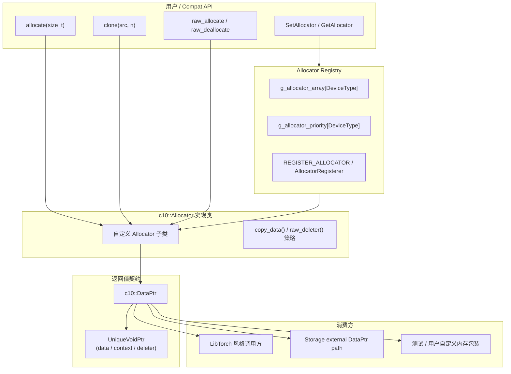
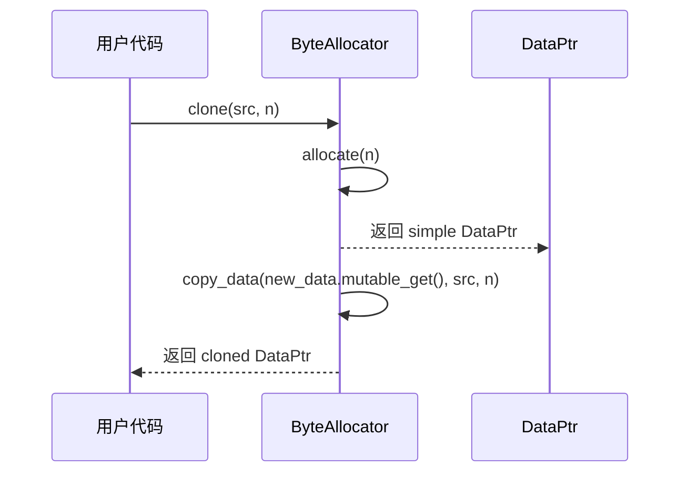
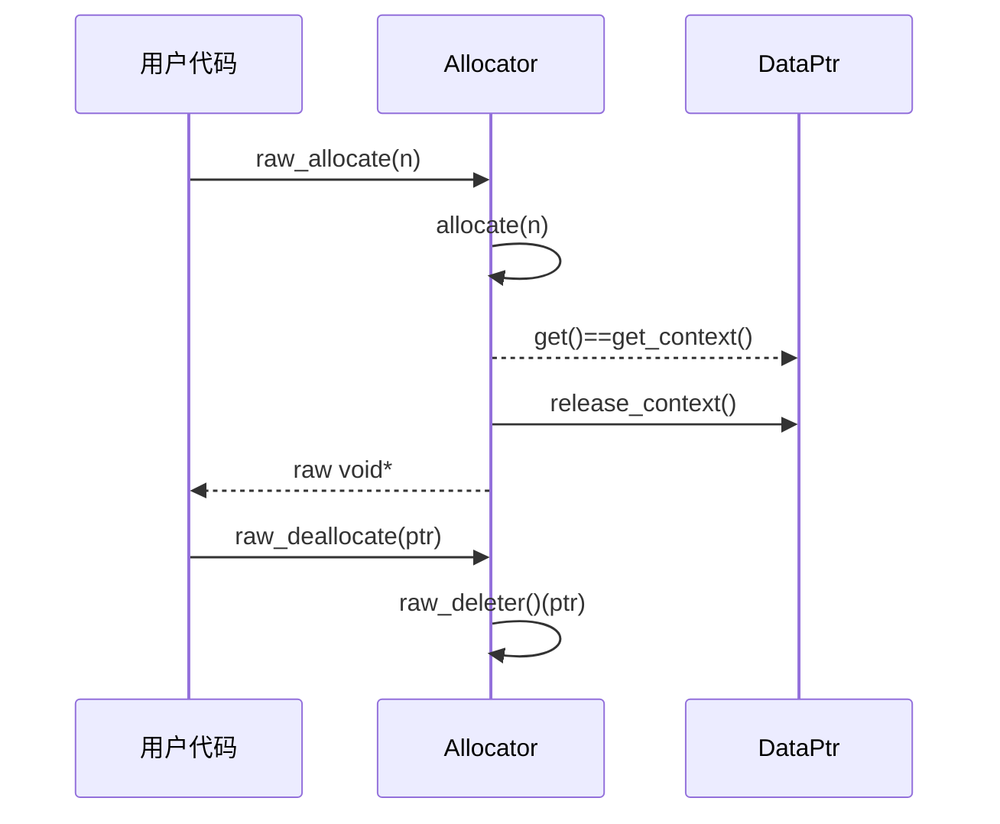

# Paddle compat 层 Allocator 机制学习文档

本文档结合具体代码，一步步讲解 Paddle compat 层中 `c10::Allocator` 的架构设计与实现原理。

> **Note**: 本文档参考 `/home/may/PaddleCppAPITest/doc/c10/core/storage_compat_arch.md` 的行文脉络，并结合 `/home/may/Paddle/paddle/phi/api/include/compat/c10/core/Allocator.h`、`/home/may/PaddleCppAPITest/test/c10/core/AllocatorCompatTest.cpp` 以及 `/home/may/Paddle/test/cpp/compat/c10_storage_test.cc` 编写。

---

## 1. 整体架构概览

在 PyTorch 语义里，`c10::Allocator` 是“按设备类型返回 `DataPtr` 的分配器接口”。Paddle compat 层基本保留了这套设计，但它的实际定位更偏向：

- 对齐 LibTorch 的内存分配 API 形状
- 为 `DataPtr`、deleter、raw allocator 接口提供统一语义
- 提供一个轻量级的 `DeviceType -> Allocator*` 注册表

同时要注意，compat `c10::Allocator` 并**不是** Paddle 原生 `phi::Allocator` 的直接替代；当前 compat 实现中，`Storage` 主路径实际接的是 `phi::Allocator*` / `phi::Allocation`。

### 1.1 核心组件关系图



### 1.2 关键设计原则

| 设计点 | 说明 |
|--------|------|
| **`DataPtr` 是统一返回值** | allocator 不直接返回裸指针，而是返回带设备、deleter、context 的 `DataPtr` |
| **raw 接口是受约束的退化路径** | 只有 `data == context` 的 simple DataPtr 才能安全退化成 `void*` |
| **分配与拷贝职责分离** | `allocate()` 负责创建新 `DataPtr`，`copy_data()` 负责字节复制，`clone()` 只是两者组合 |
| **注册表是轻量静态结构** | compat 层用两个静态数组维护 allocator 指针与优先级，不依赖复杂全局单例 |
| **优先级覆盖而非首次注册锁定** | 新注册 allocator 只要优先级不低于旧值，就能覆盖当前条目 |
| **与 Paddle 原生内存系统并存** | `c10::Allocator` 提供 PyTorch 兼容抽象；Paddle 真实 tensor/storage 主路径依旧以 `phi::Allocator` / `phi::Allocation` 为主 |

---

## 2. 核心组件详解

### 2.1 Allocator - 以 `DataPtr` 为中心的分配接口

compat 层的 `Allocator` 定义非常紧凑：

```cpp
// paddle/phi/api/include/compat/c10/core/Allocator.h (lines 127-188)
struct Allocator {
  virtual ~Allocator() = default;

  virtual DataPtr allocate(size_t n) = 0;

  DataPtr clone(const void* data, std::size_t n) {
    auto new_data = allocate(n);
    copy_data(new_data.mutable_get(), data, n);
    return new_data;
  }

  virtual bool is_simple_data_ptr(const DataPtr& data_ptr) const {
    return data_ptr.get() == data_ptr.get_context();
  }

  virtual DeleterFnPtr raw_deleter() const { return nullptr; }

  void* raw_allocate(size_t n) {
    auto dptr = allocate(n);
    TORCH_CHECK(dptr.get() == dptr.get_context(),
                "raw_allocate: DataPtr context must equal data pointer");
    return dptr.release_context();
  }

  void raw_deallocate(void* ptr) {
    auto d = raw_deleter();
    TORCH_CHECK(d != nullptr, "raw_deallocate: deleter must not be null");
    d(ptr);
  }

  virtual void copy_data(void* dest,
                         const void* src,
                         std::size_t count) const = 0;
};
```

**关键点**：

- `allocate()` 是唯一必须实现的分配入口，但返回值必须是 `DataPtr`，不能只是 `void*`。
- `clone()` 不关心原始分配上下文，只负责：
  1. 调 `allocate(n)` 创建新内存
  2. 调 `copy_data()` 拷贝字节
- `is_simple_data_ptr()` 是 raw 接口的前置判定函数。
- `raw_allocate()` / `raw_deallocate()` 本质上是给只能处理裸指针的外部接口准备的兼容出口。

### 2.2 DataPtr 是 Allocator 的“契约对象”

虽然本文聚焦 `Allocator`，但必须明确：allocator 的所有语义都通过 `DataPtr` 暴露出来。

```cpp
// paddle/phi/api/include/compat/c10/core/Allocator.h (lines 53-109)
class DataPtr {
 public:
  DataPtr() : device_(phi::CPUPlace()) {}
  DataPtr(void* data, Device device)
      : ptr_(data), device_(device._PD_GetInner()) {}
  DataPtr(void* data, void* ctx, DeleterFnPtr ctx_deleter, Device device)
      : ptr_(data, ctx, ctx_deleter), device_(device._PD_GetInner()) {}

  void* get() const { return ptr_.get(); }
  void* mutable_get() { return ptr_.get(); }
  void* get_context() const { return ptr_.get_context(); }
  void* release_context() { return ptr_.release_context(); }
  DeleterFnPtr get_deleter() const { return ptr_.get_deleter(); }
  Device device() const { return Device(device_); }

 private:
  c10::detail::UniqueVoidPtr ptr_;
  phi::Place device_;
};
```

从 allocator 视角看，`DataPtr` 至少需要承载四件事：

- 可访问的数据地址 `get()`
- 释放资源所需的上下文 `get_context()`
- 释放函数 `get_deleter()`
- 设备归属 `device()`

也正因为如此，compat allocator 的抽象能力比“传统 malloc/free 风格 allocator”更强。

### 2.3 UniqueVoidPtr - raw 接口约束的根源

allocator 为什么要区分 simple / non-simple DataPtr，本质原因在 `UniqueVoidPtr`：

```cpp
// paddle/phi/api/include/compat/c10/util/UniqueVoidPtr.h (lines 55-104)
class UniqueVoidPtr {
 private:
  void* data_;
  std::unique_ptr<void, DeleterFnPtr> ctx_;

 public:
  UniqueVoidPtr() : data_(nullptr), ctx_(nullptr, &deleteNothing) {}
  UniqueVoidPtr(void* data, void* ctx, DeleterFnPtr ctx_deleter)
      : data_(data), ctx_(ctx, ctx_deleter ? ctx_deleter : &deleteNothing) {}

  void* get() const { return data_; }
  void* get_context() const { return ctx_.get(); }
  void* release_context() { return ctx_.release(); }
  DeleterFnPtr get_deleter() const { return ctx_.get_deleter(); }
};
```

**关键含义**：

- `data_` 和 `ctx_` 可能相同，也可能不同。
- 当 `data_ != ctx_` 时，裸指针已经不足以表达完整生命周期。
- 所以 `raw_allocate()` 必须检查 `get() == get_context()`，否则就会丢失释放资源所需的上下文。

### 2.4 全局注册表 - `DeviceType -> Allocator*`

compat 层没有引入复杂的注册中心，而是直接在头文件里放了两个静态数组：

```cpp
// paddle/phi/api/include/compat/c10/core/Allocator.h (lines 235-267)
inline constexpr size_t kAllocatorRegistrySize =
    static_cast<size_t>(DeviceType::CUSTOM) + 1;

inline std::array<Allocator*, kAllocatorRegistrySize> g_allocator_array{};
inline std::array<uint8_t, kAllocatorRegistrySize> g_allocator_priority{};

inline void SetAllocator(DeviceType t, Allocator* alloc, uint8_t priority = 0) {
  const size_t index = allocator_device_index(t);
  if (priority >= g_allocator_priority[index]) {
    g_allocator_array[index] = alloc;
    g_allocator_priority[index] = priority;
  }
}

inline Allocator* GetAllocator(const DeviceType& t) {
  const size_t index = allocator_device_index(t);
  auto* alloc = g_allocator_array[index];
  TORCH_CHECK(alloc != nullptr, "Allocator for ", t, " is not set.");
  return alloc;
}
```

**设计特点**：

- 查询成本非常低，本质就是数组索引。
- 覆盖规则也很直接：`priority >= old_priority` 才替换。
- 对 compat 层而言，这个注册表足够完成 LibTorch 风格的设备级 allocator 查找。

### 2.5 `AllocatorRegisterer` / `REGISTER_ALLOCATOR` - 静态注册机制

为了保持 PyTorch 使用习惯，compat 层保留了静态注册宏：

```cpp
// paddle/phi/api/include/compat/c10/core/Allocator.h (lines 264-272)
template <DeviceType t>
struct AllocatorRegisterer {
  explicit AllocatorRegisterer(Allocator* alloc) { SetAllocator(t, alloc); }
};

#define REGISTER_ALLOCATOR(t, f)                       \
  namespace {                                          \
  static c10::AllocatorRegisterer<t> g_allocator_d(f); \
  }
```

这意味着：

- 宏展开时就会触发注册
- 不需要额外调用初始化函数
- 注册结果仍然遵守 `SetAllocator()` 的优先级覆盖规则

### 2.6 `InefficientStdFunctionContext` - allocator 周边的 deleter 适配器

这个工具不属于 `Allocator` 抽象本体，但它是 compat allocator 体系的重要补丁：它把 `std::function<void(void*)>` 适配成 `DataPtr` 能接受的 `DeleterFnPtr`。

```cpp
// paddle/phi/api/include/compat/c10/core/Allocator.h (lines 190-233)
struct InefficientStdFunctionContext {
  void* ptr_{nullptr};
  std::function<void(void*)> deleter_;

  ~InefficientStdFunctionContext() {
    if (deleter_) {
      deleter_(ptr_);
    }
  }

  static DataPtr makeDataPtr(void* ptr,
                             std::function<void(void*)> deleter,
                             Device device) {
    return DataPtr(ptr,
                   new InefficientStdFunctionContext(ptr, std::move(deleter)),
                   &deleteContext,
                   device);
  }
};
```

它的存在说明 compat allocator 体系并不只面向“简单 new/delete”，也考虑了外部内存和自定义回调释放场景。

### 2.7 与 Paddle `phi::Allocator` 的关系

这一点很容易混淆，值得单独说清楚。当前 compat 实现里，`Storage` 保存的是 `phi::Allocator*`，而不是 `c10::Allocator*`：

```cpp
// paddle/phi/api/include/compat/c10/core/Storage.h (lines 44-47, 129-145)
struct StorageImpl {
  std::shared_ptr<phi::Allocation> data_allocation_;
  phi::Allocator* allocator_ = nullptr;
  ...
};

explicit Storage(size_t size_bytes, phi::Allocator* allocator = nullptr) {
  ...
}

Storage(use_byte_size_t /*use_byte_size*/,
        size_t size_bytes,
        phi::Allocator* allocator = nullptr,
        bool resizable = false) {
  ...
}
```

**从当前源码可以得出一个重要结论**：

- `c10::Allocator` 是 compat API 层的分配抽象。
- `phi::Allocator` / `phi::Allocation` 才是 Paddle tensor / storage 主路径里的底层内存抽象。
- 也就是说，compat `Allocator` 当前更像是“PyTorch 风格接口兼容层”，而不是全面替换 Paddle 原生分配体系的统一后端。

---

## 3. 典型执行流程

### 3.1 `allocate()` / `clone()` 流程

以测试中的 `ByteAllocator` 为例：

```cpp
// test/c10/core/AllocatorCompatTest.cpp (lines 47-60)
class ByteAllocator final : public c10::Allocator {
 public:
  c10::DataPtr allocate(size_t n) override {
    size_t bytes = n == 0 ? 1 : n;
    char* data = new char[bytes];
    return c10::DataPtr(
        data, data, delete_byte_array, c10::Device(c10::DeviceType::CPU));
  }

  void copy_data(void* dest,
                 const void* src,
                 std::size_t count) const override {
    default_copy_data(dest, src, count);
  }
};
```

它的 `clone()` 调用链是：



**关键点**：

- `clone()` 不复制旧 `DataPtr` 的 context，只复制原始字节数据。
- 因此 cloned allocation 与 source allocation 在生命周期上是独立的。

### 3.2 raw 接口成功路径

当 allocator 返回的是 simple DataPtr，`raw_allocate()` / `raw_deallocate()` 可以工作：

```cpp
// /home/may/Paddle/test/cpp/compat/c10_storage_test.cc (lines 676-680)
RawCompatibleAllocator alloc;
void* raw = alloc.raw_allocate(8);
ASSERT_NE(raw, nullptr);
alloc.raw_deallocate(raw);
```

流程如下：



### 3.3 raw 接口失败路径

compat 测试也覆盖了两个失败条件：

```cpp
// /home/may/Paddle/test/cpp/compat/c10_storage_test.cc (lines 683-690)
RawIncompatibleAllocator alloc;
EXPECT_THROW((void)alloc.raw_allocate(8), std::exception);

NullRawDeleterAllocator alloc2;
EXPECT_THROW(alloc2.raw_deallocate(reinterpret_cast<void*>(0x1)),
             std::exception);
```

失败原因分别是：

1. `raw_allocate()` 拿到的 `DataPtr` 不满足 `get() == get_context()`
2. `raw_deallocate()` 的 `raw_deleter()` 返回 `nullptr`

所以 raw API 并不是 allocator 的“默认能力”，而是**有先决条件的额外能力**。

### 3.4 allocator 注册与优先级覆盖流程

`SetAllocator()` 的行为很像一个“按设备类型注册、按优先级覆盖”的小型路由表：

```cpp
// test/c10/core/AllocatorCompatTest.cpp (lines 520-545)
c10::SetAllocator(c10::DeviceType::XPU, &high_priority_allocator, 2);
...
c10::SetAllocator(c10::DeviceType::XPU, &low_priority_allocator, 1);
...
c10::SetAllocator(c10::DeviceType::XPU, &low_priority_allocator, 2);
...
```

这个测试说明：

- 新 allocator 优先级更低时，不覆盖旧值
- 优先级相等时，可以覆盖旧值

也就是说，当前实现的规则不是“严格大于才覆盖”，而是“**大于等于**就覆盖”。

---

## 4. 测试代码解读

### 4.1 `ByteAllocator` 是最小可用 allocator 范例

`ByteAllocator` 同时给出了 compat allocator 的两个最小要求：

- 实现 `allocate(size_t)`
- 实现 `copy_data(void*, const void*, size_t)`

并且它返回的是最标准的 simple DataPtr：

```cpp
// test/c10/core/AllocatorCompatTest.cpp (lines 47-54)
char* data = new char[bytes];
return c10::DataPtr(
    data, data, delete_byte_array, c10::Device(c10::DeviceType::CPU));
```

### 4.2 `is_simple_data_ptr()` 的语义被明确钉死

```cpp
// test/c10/core/AllocatorCompatTest.cpp (lines 494-517)
c10::DataPtr simple_ptr(..., test_data_, test_deleter, ...);
c10::DataPtr view_ptr(static_cast<void*>(test_data_),
                      c10::Device(c10::DeviceType::CPU));
c10::DataPtr separate_ctx_ptr(..., test_ctx_, test_deleter, ...);
```

测试结论：

- `simple_ptr` -> `true`
- `view_ptr` -> `false`
- `separate_ctx_ptr` -> `false`

也就是说，compat 实现与 PyTorch 一样，把“simple DataPtr”严格限定为 `data == context`。

### 4.3 `clone()` 的语义是“重新分配 + 拷贝字节”

```cpp
// /home/may/Paddle/test/cpp/compat/c10_storage_test.cc (lines 699-715)
c10::DataPtr src = alloc.allocate(4);
...
c10::DataPtr cloned = alloc.clone(src.get(), 4);
...
ASSERT_EQ(dst_bytes[0], 1);
ASSERT_EQ(dst_bytes[1], 2);
ASSERT_EQ(dst_bytes[2], 3);
ASSERT_EQ(dst_bytes[3], 4);
```

这说明 `clone()` 的正确性不依赖 allocator 子类自己重写，只要：

- `allocate()` 正确
- `copy_data()` 正确

默认实现就能工作。

### 4.4 `InefficientStdFunctionContext` 真正执行了外部 deleter

```cpp
// test/c10/core/AllocatorCompatTest.cpp (lines 465-490)
c10::DataPtr data_ptr = c10::InefficientStdFunctionContext::makeDataPtr(
    value,
    [&deleter_called](void* ptr) {
      deleter_called = true;
      delete static_cast<int*>(ptr);
    },
    c10::Device(c10::DeviceType::CPU));
```

测试验证：

- `get_context()` 不再是原始数据指针
- `DataPtr` 析构后，用户 lambda 会被真正调用

### 4.5 `REGISTER_ALLOCATOR` 的作用是静态编译期注册

```cpp
// test/c10/core/AllocatorCompatTest.cpp (lines 63-64)
static ByteAllocator g_registered_allocator;
REGISTER_ALLOCATOR(c10::DeviceType::IPU, &g_registered_allocator);
```

这段代码配合 `RegisterAllocatorMacro` 用例，等价于确认：

- 宏能正常展开
- 文件作用域静态注册路径是有效的

---

## 5. 与 PyTorch 的对比

| 属性 | PyTorch `c10::Allocator` | Paddle compat `c10::Allocator` |
|------|---------------------------|--------------------------------|
| 核心返回值 | `DataPtr` | `DataPtr` |
| `clone()` / `raw_*` 接口 | 有 | 有 |
| `is_simple_data_ptr()` 语义 | `get() == get_context()` | 相同 |
| 注册机制 | `SetAllocator` / `GetAllocator` / `REGISTER_ALLOCATOR` | 相同思路 |
| `std::function` deleter 适配 | `InefficientStdFunctionContext` | 已保留 |
| 设备元数据存储 | `Device` | `phi::Place`，对外仍暴露 `Device` |
| 与框架原生 allocator 的关系 | 就是 PyTorch 自身分配抽象的一部分 | 与 `phi::Allocator` 并存，主要承担 compat 层 API 对齐职责 |

**最关键的 compat 差异**：

- 在 PyTorch 中，`c10::Allocator` 更直接地属于框架底层内存体系的一部分。
- 在 Paddle compat 中，`c10::Allocator` 当前更像是对 LibTorch 分配语义的复刻；Paddle tensor/storage 的主分配路径仍主要基于 `phi::Allocator` / `phi::Allocation`。

---

## 6. 注意事项

1. **不要把 `allocate()` 当作“返回裸指针”的接口**：compat allocator 的真正契约是返回 `DataPtr`，生命周期信息必须随对象一起返回。

2. **raw API 只能用于 simple DataPtr**：如果 `data != context`，就不能安全地只靠一个 `void*` 完成释放。

3. **`raw_deleter()` 默认是 `nullptr`**：这意味着 allocator 默认并不承诺支持 raw deallocate 路径。

4. **`clone()` 只复制字节，不复制旧 context**：它依赖的是 `allocate()` 和 `copy_data()`，而不是复用源 `DataPtr` 的内部所有权。

5. **优先级覆盖规则是 `>=`**：相同优先级的新 allocator 也会覆盖旧值。

6. **compat `c10::Allocator` 和 `phi::Allocator` 不同层**：当前源码下，后者仍然是 Paddle tensor/storage 主路径真正接线的底层分配器。

7. **`DataPtr(void*, Device)` 不是 simple DataPtr**：因为它的 `context == nullptr`，所以不能直接走 raw allocator 退化路径。

---

## 7. 参考代码路径

| 文件 | 说明 |
|------|------|
| `/home/may/Paddle/paddle/phi/api/include/compat/c10/core/Allocator.h` | `Allocator`、`DataPtr`、注册表与 `InefficientStdFunctionContext` 定义 |
| `/home/may/Paddle/paddle/phi/api/include/compat/c10/util/UniqueVoidPtr.h` | `DataPtr` 背后的 context/deleter 所有权模型 |
| `/home/may/Paddle/paddle/phi/api/include/compat/c10/core/Storage.h` | 说明 compat `Storage` 当前主要接的是 `phi::Allocator*` / `phi::Allocation` |
| `/home/may/PaddleCppAPITest/test/c10/core/AllocatorCompatTest.cpp` | `Allocator`/`DataPtr` 兼容性测试 |
| `/home/may/Paddle/test/cpp/compat/c10_storage_test.cc` | `raw_allocate/raw_deallocate`、`clone()`、simple DataPtr 语义测试 |
| `/home/may/PaddleCppAPITest/doc/c10/core/storage_compat_arch.md` | 本文档的写作脉络参考 |
| `/home/may/PaddleCppAPITest/doc/c10/core/data_ptr_compat_arch.md` | 如需深入 `DataPtr` 自身机制，可继续参考此文档 |
