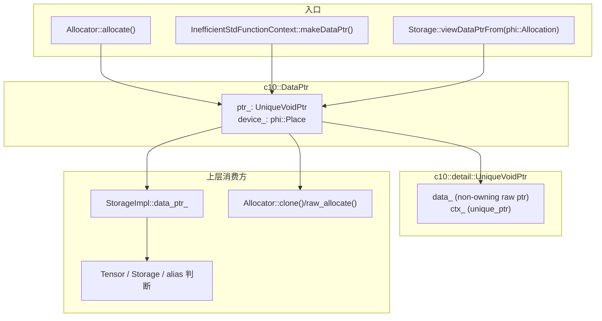
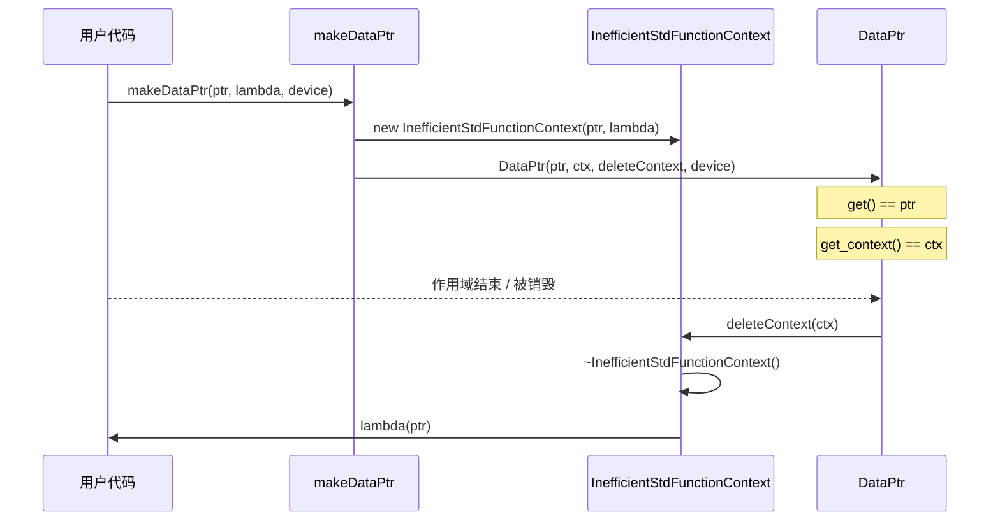

# Paddle compat 层 DataPtr 机制学习文档

本文档结合具体代码，一步步讲解 Paddle compat 层中 `c10::DataPtr` 的架构设计与实现原理。

> **Note**: 本文档参考 `/home/may/PaddleCppAPITest/doc/c10/core/storage_compat_arch.md`，并结合 Paddle 测试代码 `/home/may/PaddleCppAPITest/test/c10/core/AllocatorCompatTest.cpp`、`/home/may/PaddleCppAPITest/test/c10/core/StorageTest.cpp` 与 `from_blob` 相关实现编写。

---

## 1. 整体架构概览

`c10::DataPtr` 是 compat 层最核心的“内存句柄”之一。它不只是一个 `void*`，而是把以下几类信息打包在一起：

- 当前可访问的数据地址
- 真正用于释放资源的上下文对象
- 释放函数 `DeleterFnPtr`
- 设备信息 `Device`

在 Paddle compat 层里，`DataPtr` 既可以是**真正拥有内存的 owning handle**，也可以是从 `phi::Allocation` 派生出来的**非拥有性视图**。

### 1.1 核心组件关系图



### 1.2 关键设计原则

| 设计点 | 说明 |
|--------|------|
| **数据指针与释放上下文分离** | `data_` 用于访问数据，`ctx_` 用于析构时执行 deleter，两者可以相同也可以不同 |
| **move-only 语义** | `DataPtr` 禁止拷贝，只能移动，避免同一释放上下文被多个句柄重复析构 |
| **设备信息独立保存** | 即使是空 `DataPtr`，仍然可以保存设备元数据；compat 层内部实际存的是 `phi::Place` |
| **simple / wrapped context 区分** | `Allocator::is_simple_data_ptr()` 通过 `get() == get_context()` 判断是否是“简单上下文” |
| **owning 与 viewing 两种模式共存** | 外部分配路径直接持有 deleter；`phi::Allocation` 路径只暴露一个非 owning 的 `DataPtr` 视图 |
| **Storage 与 Tensor 是主要消费者** | `StorageImpl::data_ptr_` 保存 `DataPtr`，`TensorBase::data_ptr()` 则根据 tensor 当前视图返回实际可访问地址 |

---

## 2. 核心组件详解

### 2.1 UniqueVoidPtr - 真正的所有权内核

`DataPtr` 的真正“所有权逻辑”不在自己身上，而在 `UniqueVoidPtr` 里：

```cpp
// paddle/phi/api/include/compat/c10/util/UniqueVoidPtr.h (lines 55-105)
class UniqueVoidPtr {
 private:
  void* data_;
  std::unique_ptr<void, DeleterFnPtr> ctx_;

 public:
  UniqueVoidPtr() : data_(nullptr), ctx_(nullptr, &deleteNothing) {}
  explicit UniqueVoidPtr(void* data)
      : data_(data), ctx_(nullptr, &deleteNothing) {}
  UniqueVoidPtr(void* data, void* ctx, DeleterFnPtr ctx_deleter)
      : data_(data), ctx_(ctx, ctx_deleter ? ctx_deleter : &deleteNothing) {}

  void clear() {
    ctx_ = nullptr;
    data_ = nullptr;
  }

  void* get() const { return data_; }
  void* get_context() const { return ctx_.get(); }
  void* release_context() { return ctx_.release(); }

  bool unsafe_reset_data_and_ctx(void* new_data_and_ctx) {
    if (__builtin_expect(
            static_cast<bool>((ctx_.get_deleter() != &deleteNothing)), 0)) {
      return false;
    }
    (void)ctx_.release();
    ctx_.reset(new_data_and_ctx);
    data_ = new_data_and_ctx;
    return true;
  }
};
```

**关键点**：

- `data_` 是**非 owning 的访问指针**，用于 `get()` / `operator->()`。
- `ctx_` 是**owning 的上下文指针**，析构时由 `DeleterFnPtr` 处理。
- 当 `data_ != ctx_` 时，表示“数据地址”和“释放所需上下文”是两套对象。
- 这正是 `UniqueVoidPtr` 相比 `std::unique_ptr<void>` 的核心价值：它可以正确表达 `DLManagedTensor`、外部 buffer wrapper 这类“访问指针不等于释放上下文”的场景。

### 2.2 DataPtr - 带设备语义的轻量句柄

`DataPtr` 本身只是把 `UniqueVoidPtr` 再包装一层，并补上设备信息：

```cpp
// paddle/phi/api/include/compat/c10/core/Allocator.h (lines 53-109)
class DataPtr {
 public:
  DataPtr() : device_(phi::CPUPlace()) {}

  DataPtr(void* data, Device device)
      : ptr_(data), device_(device._PD_GetInner()) {}

  DataPtr(void* data, void* ctx, DeleterFnPtr ctx_deleter, Device device)
      : ptr_(data, ctx, ctx_deleter), device_(device._PD_GetInner()) {}

  DataPtr(const DataPtr&) = delete;
  DataPtr& operator=(const DataPtr&) = delete;
  DataPtr(DataPtr&&) = default;
  DataPtr& operator=(DataPtr&&) = default;

  void* get() const { return ptr_.get(); }
  void* mutable_get() { return ptr_.get(); }
  void* get_context() const { return ptr_.get_context(); }
  DeleterFnPtr get_deleter() const { return ptr_.get_deleter(); }
  Device device() const { return Device(device_); }

 private:
  c10::detail::UniqueVoidPtr ptr_;
  phi::Place device_;
};
```

**这里最重要的兼容层特征**：

- 对外接口保持 PyTorch 风格：`get()`、`device()`、`operator bool()`、`cast_context<T>()` 等都可直接用。
- 对内设备保存方式换成了 `phi::Place`，再通过 `Device(device_)` 转回 `c10::Device`。
- `DataPtr(void*, Device)` 创建的是**非 owning 视图**：
  - `get() == data`
  - `get_context() == nullptr`
  - deleter 是 `deleteNothing`
- `DataPtr(void*, void*, DeleterFnPtr, Device)` 创建的是**owning handle**：
  - `get()` 是用户访问的数据指针
  - `get_context()` 是最终交给 deleter 的上下文

### 2.3 Allocator - DataPtr 的生产者与策略接口

`Allocator` 的职责不是“返回裸内存”，而是“返回能完整描述生命周期的 `DataPtr`”：

```cpp
// paddle/phi/api/include/compat/c10/core/Allocator.h (lines 127-188)
struct Allocator {
  virtual ~Allocator() = default;

  virtual DataPtr allocate(size_t n) = 0;

  DataPtr clone(const void* data, std::size_t n) {
    auto new_data = allocate(n);
    copy_data(new_data.mutable_get(), data, n);
    return new_data;
  }

  virtual bool is_simple_data_ptr(const DataPtr& data_ptr) const {
    return data_ptr.get() == data_ptr.get_context();
  }

  virtual DeleterFnPtr raw_deleter() const { return nullptr; }

  void* raw_allocate(size_t n) {
    auto dptr = allocate(n);
    TORCH_CHECK(dptr.get() == dptr.get_context(),
                "raw_allocate: DataPtr context must equal data pointer");
    return dptr.release_context();
  }
};
```

**关键点**：

- `allocate()` 的返回值必须自带生命周期语义。
- `clone()` 只复制数据，不复制原 `DataPtr` 的上下文对象。
- `is_simple_data_ptr()` 的判定标准非常严格：只有 `get() == get_context()` 才算 simple。
- `raw_allocate()` 只适用于 simple DataPtr；否则无法安全退化成只返回 `void*` 的接口。

### 2.4 InefficientStdFunctionContext - lambda deleter 适配器

`DataPtr` 只能保存 `DeleterFnPtr` 这种 C 风格函数指针，而很多用户 API 需要接受 `std::function<void(void*)>`。compat 层通过 `InefficientStdFunctionContext` 完成桥接：

```cpp
// paddle/phi/api/include/compat/c10/core/Allocator.h (lines 190-233)
struct InefficientStdFunctionContext {
  void* ptr_{nullptr};
  std::function<void(void*)> deleter_;

  ~InefficientStdFunctionContext() {
    if (deleter_) {
      deleter_(ptr_);
    }
  }

  static DataPtr makeDataPtr(void* ptr,
                             std::function<void(void*)> deleter,
                             Device device) {
    return DataPtr(ptr,
                   new InefficientStdFunctionContext(ptr, std::move(deleter)),
                   &deleteContext,
                   device);
  }
};
```

**含义**：

- `DataPtr` 自己不直接保存 lambda。
- compat 层先在堆上分配一个 `InefficientStdFunctionContext`。
- `DataPtr` 实际持有的是：
  - `data = 原始数据地址`
  - `ctx = InefficientStdFunctionContext*`
  - `deleter = deleteContext`
- 最终的释放链路变成：`deleteContext(ctx)` -> `~InefficientStdFunctionContext()` -> 用户提供的 lambda。

---

## 3. 三条典型生命周期路径

### 3.1 Simple owning 路径：`data == context`

测试里的 `ByteAllocator` 直接返回“简单上下文”形式的 `DataPtr`：

```cpp
// test/c10/core/AllocatorCompatTest.cpp (lines 47-60)
class ByteAllocator final : public c10::Allocator {
 public:
  c10::DataPtr allocate(size_t n) override {
    size_t bytes = n == 0 ? 1 : n;
    char* data = new char[bytes];
    return c10::DataPtr(
        data, data, delete_byte_array, c10::Device(c10::DeviceType::CPU));
  }
};
```

此时：

- `get() == data`
- `get_context() == data`
- `get_deleter() == delete_byte_array`
- `is_simple_data_ptr()` 返回 `true`

这是最适合和 `raw_allocate()` / `raw_deallocate()` 互操作的形态。

### 3.2 Wrapped context 路径：`data != context`

如果释放逻辑依赖额外对象，就需要把上下文单独包起来：



这类 `DataPtr` 的特点：

- `get()` 指向用户真正访问的数据
- `get_context()` 指向包装对象
- `Allocator::is_simple_data_ptr()` 会返回 `false`
- 不能安全退化成“只凭一个裸指针就能释放”的 raw API

### 3.3 Allocation-backed view 路径：`phi::Allocation` 派生出的非 owning 视图

这是 Paddle compat 相比原生 PyTorch 更值得注意的一条路径。`Storage` 在接管 `phi::Allocation` 时，不会把所有权转移给 `DataPtr`，而是保留 `shared_ptr<phi::Allocation>`，同时生成一个只读生命周期视图：

```cpp
// paddle/phi/api/include/compat/c10/core/Storage.h (lines 390-417)
void syncFromAllocation(std::shared_ptr<phi::Allocation> new_alloc) {
  impl_->data_allocation_ = std::move(new_alloc);
  if (impl_->data_allocation_) {
    impl_->nbytes_ = impl_->data_allocation_->size();
    impl_->place_ = impl_->data_allocation_->place();
  } else {
    impl_->nbytes_ = 0;
    impl_->place_ = phi::Place();
  }
  impl_->data_ptr_ = viewDataPtrFrom(impl_->data_allocation_);
}

static DataPtr viewDataPtrFrom(const std::shared_ptr<phi::Allocation>& alloc) {
  if (!alloc) return DataPtr();
  return DataPtr(alloc->ptr(), c10::Device(alloc->place()));
}
```

**这里要特别注意**：

- `impl_->data_allocation_` 才是真正 owning 的对象。
- `impl_->data_ptr_` 只是一个 `DataPtr(void*, Device)` 视图。
- 因为 `get_context() == nullptr`，所以它不是 simple DataPtr。
- 这正是 compat 层为了桥接 Paddle 内存系统而引入的“view DataPtr”语义。

### 3.4 `from_blob` 路径：先进入 `phi::Allocation`，再间接暴露 DataPtr

从当前实现看，ATen compat 的 `from_blob` 并没有直接构造 `c10::DataPtr`，而是先把 deleter / context 适配成 Paddle 的 `paddle::Deleter`，再走 `phi::Allocation` 路径。

这个结论是根据下面两段实现**推断**出来的：

```cpp
// paddle/phi/api/include/compat/ATen/ops/from_blob.h (lines 76-131)
Tensor make_tensor() {
  paddle::Deleter pd_deleter = nullptr;
  if (deleter_) {
    pd_deleter = deleter_;
  } else if (ctx_) {
    auto shared_ctx =
        std::shared_ptr<void>(ctx_.release(), ctx_.get_deleter());
    pd_deleter = [shared_ctx](void* /*data*/) {};
  }

  return paddle::from_blob(..., pd_place, pd_deleter);
}
```

```cpp
// paddle/phi/api/lib/tensor_utils.cc (lines 121-132)
if (deleter) {
  DeleterManager::Instance()->RegisterPtr(data, deleter);
  alloc_deleter = [](phi::Allocation* p) {
    DeleterManager::Instance()->DeletePtr(p->ptr());
  };
}

auto alloc = std::make_shared<phi::Allocation>(
    data, size * SizeOf(meta.dtype), alloc_deleter, data_place);
return Tensor(std::make_shared<phi::DenseTensor>(alloc, meta));
```

也就是说：

1. `from_blob` 先生成 `phi::Allocation`
2. `phi::Allocation` 负责持有真正的外部 deleter
3. 只有当后续需要 `storage().data_ptr()` 时，`Storage::syncFromAllocation()` 才会再生成一个 `DataPtr` 视图

这和“直接把外部内存封装成 owning `DataPtr` 再塞给 `Storage`”是两条不同的实现路线。

---

## 4. DataPtr 与 Storage / Tensor 的关系

### 4.1 Storage 里保存的是“base pointer 语义”的 DataPtr

`StorageImpl` 直接持有 `DataPtr data_ptr_`：

```cpp
// paddle/phi/api/include/compat/c10/core/Storage.h (lines 44-55)
struct StorageImpl {
  std::shared_ptr<phi::Allocation> data_allocation_;
  phi::Allocator* allocator_ = nullptr;
  size_t nbytes_ = 0;
  bool resizable_ = false;
  phi::Place place_;
  DataPtr data_ptr_;
  std::weak_ptr<StorageHolderView> tensor_holder_;
};
```

因此 `storage.data_ptr().get()` 表示的是 **storage 基地址语义**。

### 4.2 TensorBase::data_ptr() 保留视图 offset

`TensorBase` 并不直接返回 `storage.data_ptr().get()`，而是返回当前 tensor 实际可访问的数据地址：

```cpp
// paddle/phi/api/include/compat/ATen/core/TensorBase.h (lines 115-123)
void* data_ptr() const {
  if (!tensor_.defined()) {
    return nullptr;
  }
  return const_cast<void*>(tensor_.data());
}
```

文件注释已经写明：`tensor.data_ptr()` 会在和 `storage()` 保持一致的前提下，保留 view 的 offset 语义。

### 4.3 测试如何印证这件事

`StorageTest` 里有两个很能说明问题的用例：

```cpp
// test/c10/core/StorageTest.cpp (lines 230-255)
at::Tensor sliced = tensor.slice(0, 1, 2);
file << std::to_string(sliced.storage().data_ptr().get() ==
                       tensor.storage().data_ptr().get()) << " ";
file << std::to_string(sliced.storage_offset() > 0) << " ";

c10::Storage storage = tensor.storage();
void* storage_ptr = storage.data_ptr().get();
void* tensor_ptr = tensor.data_ptr();
file << std::to_string(storage_ptr == tensor_ptr) << " ";
```

**可以据此理解**：

- 对于 offset 为 0 的普通 tensor，`tensor.data_ptr()` 与 `tensor.storage().data_ptr().get()` 一致。
- 对于 slice/view tensor，`storage().data_ptr().get()` 仍然是共享 storage 的基地址，而 `tensor.data_ptr()` 会体现视图偏移。

后一句是根据 `TensorBase::data_ptr()` 实现和 `SlicedTensorStorageOffset` 测试结果做出的**实现层推断**。

---

## 5. 测试代码解读

### 5.1 默认构造与空对象语义

```cpp
// test/c10/core/AllocatorCompatTest.cpp (lines 71-89)
c10::DataPtr data_ptr;
file << std::to_string(data_ptr.get() == nullptr) << " ";
file << std::to_string(static_cast<bool>(data_ptr) == false) << " ";
file << std::to_string(data_ptr.get_context() == nullptr) << " ";
file << std::to_string(data_ptr.get_deleter() != nullptr) << " ";
```

**说明**：

- 默认构造出的 `DataPtr` 是空指针。
- 但默认 deleter 不是空，而是 `deleteNothing`。
- 这和 `UniqueVoidPtr()` 的实现完全对应。

### 5.2 `clear()` 只清空指针，不抹掉 deleter 类型

```cpp
// test/c10/core/AllocatorCompatTest.cpp (lines 205-227)
c10::DataPtr data_ptr(static_cast<void*>(test_data_),
                      test_ctx_,
                      test_deleter,
                      c10::Device(c10::DeviceType::CPU));
data_ptr.clear();
file << std::to_string(data_ptr.get() == nullptr) << " ";
file << std::to_string(data_ptr.get_context() == nullptr) << " ";
file << std::to_string(data_ptr.get_deleter() == test_deleter) << " ";
```

**说明**：

- `clear()` 之后，`data` 和 `context` 都被置空。
- 但 deleter 类型保留下来了。
- 这也解释了为什么 `UniqueVoidPtr::clear()` 用的是 `ctx_ = nullptr`，而不是重建一个新的 `unique_ptr<void, DeleterFnPtr>`。

### 5.3 move-only 语义

```cpp
// test/c10/core/AllocatorCompatTest.cpp (lines 327-335)
file << std::to_string(!std::is_copy_constructible_v<c10::DataPtr>) << " ";
file << std::to_string(!std::is_copy_assignable_v<c10::DataPtr>) << " ";
```

**说明**：

- `DataPtr` 被明确设计成 move-only。
- 这是为了避免多个对象共同拥有同一 `ctx_`，从而导致重复释放。

### 5.4 `InefficientStdFunctionContext` 会真正触发用户 deleter

```cpp
// test/c10/core/AllocatorCompatTest.cpp (lines 465-490)
c10::DataPtr data_ptr = c10::InefficientStdFunctionContext::makeDataPtr(
    value,
    [&deleter_called](void* ptr) {
      deleter_called = true;
      delete static_cast<int*>(ptr);
    },
    c10::Device(c10::DeviceType::CPU));
```

测试验证了两件事：

- `get_context()` 不等于原始 `value` 指针，而是包装后的 context 对象
- `DataPtr` 析构后，外部 lambda 确实会被调用

### 5.5 `is_simple_data_ptr()` 的判定口径

```cpp
// test/c10/core/AllocatorCompatTest.cpp (lines 494-517)
c10::DataPtr simple_ptr(..., test_data_, test_deleter, ...);
c10::DataPtr view_ptr(static_cast<void*>(test_data_),
                      c10::Device(c10::DeviceType::CPU));
c10::DataPtr separate_ctx_ptr(..., test_ctx_, test_deleter, ...);

file << std::to_string(allocator.is_simple_data_ptr(simple_ptr)) << " ";
file << std::to_string(allocator.is_simple_data_ptr(view_ptr)) << " ";
file << std::to_string(allocator.is_simple_data_ptr(separate_ctx_ptr)) << " ";
```

**这个测试非常关键**：

- `simple_ptr` 为 `true`
- `view_ptr` 为 `false`
- `separate_ctx_ptr` 为 `false`

也就是说，在 compat 层里，“只有 data/context 同址的 owning DataPtr 才算 simple”，单纯的 `DataPtr(void*, Device)` 视图不算。

---

## 6. 关键 API 使用示例

### 6.1 创建一个 simple owning DataPtr

```cpp
void delete_bytes(void* ptr) { delete[] static_cast<char*>(ptr); }

char* buf = new char[256];
c10::DataPtr ptr(
    buf, buf, delete_bytes, c10::Device(c10::DeviceType::CPU));

void* raw = ptr.get();
bool simple = (ptr.get() == ptr.get_context());  // true
```

### 6.2 用 `InefficientStdFunctionContext` 包装 lambda deleter

```cpp
int* value = new int(7);
c10::DataPtr ptr = c10::InefficientStdFunctionContext::makeDataPtr(
    value,
    [](void* p) { delete static_cast<int*>(p); },
    c10::Device(c10::DeviceType::CPU));

void* data = ptr.get();          // value
void* ctx = ptr.get_context();   // wrapper object
```

### 6.3 从 Storage 读取一个 allocation-backed 的 view DataPtr

```cpp
at::Tensor tensor = at::ones({2, 3}, at::kFloat);
c10::Storage storage = tensor.storage();

void* base_ptr = storage.data_ptr().get();
void* tensor_ptr = tensor.data_ptr();

// offset 为 0 时通常相同；view tensor 上 tensor_ptr 可能带偏移
```

---

## 7. 与 PyTorch 的对比

| 属性 | PyTorch DataPtr | Paddle compat DataPtr |
|------|------------------|-----------------------|
| 外层结构 | `UniqueVoidPtr + Device` | `UniqueVoidPtr + phi::Place`（对外仍暴露 `Device`） |
| 拷贝语义 | move-only | move-only |
| `UniqueVoidPtr` 设计 | `data` / `context` 分离 | 基本保持一致 |
| simple 判定 | `get() == get_context()` | 相同 |
| `InefficientStdFunctionContext` | 提供 `std::function` 桥接 | 基本保持一致 |
| allocator registry | 按 `DeviceType` 注册 allocator | 相同思路，compat 用静态数组维护 |
| Storage 内 owning 模式 | `StorageImpl` 直接围绕 `DataPtr` 工作 | 既支持直接持有 `DataPtr`，也支持通过 `phi::Allocation` 生成 view DataPtr |
| `from_blob` 外部内存路径 | 常见做法是直接围绕 deleter / context 组织 DataPtr | 当前 compat 实现先进入 `phi::Allocation`，再在 `storage()` 路径上生成 view DataPtr |

**最关键的 compat 差异**：

- PyTorch 世界里，`DataPtr` 更像是统一的底层内存所有权表示。
- Paddle compat 世界里，`DataPtr` 既可能是 owning handle，也可能只是 `phi::Allocation` 的一个兼容性视图。

---

## 8. 注意事项

1. **`DataPtr(void*, Device)` 不拥有数据**：它只有访问语义，没有释放上下文；在 compat 层里常被用作 `phi::Allocation` 的 view。

2. **`is_simple_data_ptr()` 很严格**：只有 `get() == get_context()` 才返回 `true`。单纯 view pointer 即使“看起来很简单”，也不算 simple。

3. **`clear()` 不会抹掉 deleter 类型**：它清掉的是当前 context 指针，而不是把 deleter 恢复成默认状态。

4. **`unsafe_reset_data_and_ctx()` 只能用于 no-op deleter 场景**：一旦 `UniqueVoidPtr` 当前带有真实 deleter，函数就会返回 `false`，避免破坏既有释放语义。

5. **`TensorBase::data_ptr()` 与 `Storage::data_ptr()` 语义不同**：前者面向“当前 tensor 视图”，后者面向“底层 storage 基地址”。

6. **外部内存接入并不一定直接落到 owning DataPtr**：在 `from_blob` 这类路径中，compat 层往往先接到 `phi::Allocation`，再在需要 Storage API 时生成 `DataPtr` 视图。

---

## 9. 参考代码路径

| 文件 | 说明 |
|------|------|
| `/home/may/Paddle/paddle/phi/api/include/compat/c10/core/Allocator.h` | `DataPtr`、`Allocator`、`InefficientStdFunctionContext` 定义 |
| `/home/may/Paddle/paddle/phi/api/include/compat/c10/util/UniqueVoidPtr.h` | `UniqueVoidPtr` 所有权模型 |
| `/home/may/Paddle/paddle/phi/api/include/compat/c10/core/Storage.h` | `StorageImpl::data_ptr_` 与 allocation/view DataPtr 桥接 |
| `/home/may/Paddle/paddle/phi/api/include/compat/ATen/core/TensorBase.h` | `TensorBase::data_ptr()` 的视图语义 |
| `/home/may/Paddle/paddle/phi/api/include/compat/ATen/ops/from_blob.h` | compat `from_blob` 如何适配 deleter / context |
| `/home/may/Paddle/paddle/phi/api/lib/tensor_utils.cc` | Paddle `from_blob` 如何生成 `phi::Allocation` |
| `/home/may/PaddleCppAPITest/test/c10/core/AllocatorCompatTest.cpp` | `DataPtr` / `Allocator` 兼容行为测试 |
| `/home/may/PaddleCppAPITest/test/c10/core/StorageTest.cpp` | `Storage` 与 `DataPtr` 交互测试 |
