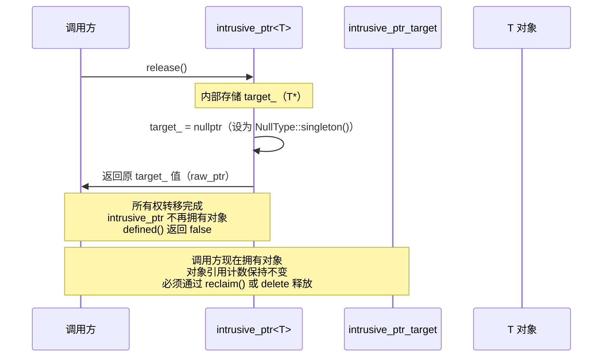
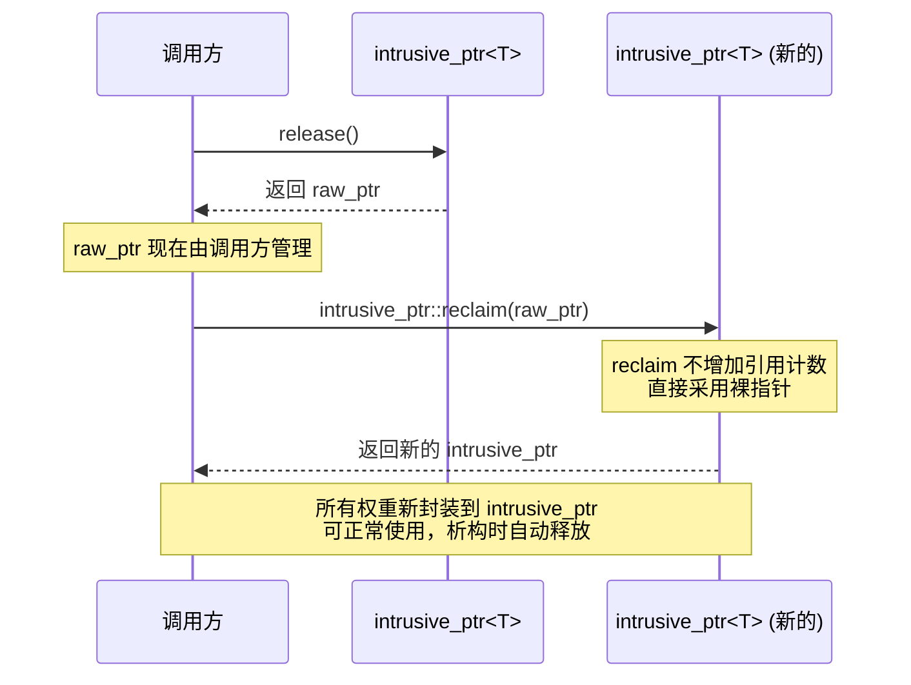

##### intrusive_ptr.h 头文件 API 兼容性

对比文件：
- `/home/may/Paddle/paddle/phi/api/include/compat/c10/util/intrusive_ptr.h`
- `/home/may/pytorch/c10/util/intrusive_ptr.h`

状态说明：
- `✅` 已实现（接口存在且签名/语义基本一致）
- `🔧` 部分兼容（接口存在，但签名或实现语义有差异）
- `❌` 未实现（PyTorch 有，Paddle compat 头文件无）

---

### 核心类型与标签

| torch API | paddle API 兼容性 | 测试用例状态 | 优先级 | 备注 |
|-----------|------------------|------------|-------|------|
| `intrusive_ptr_target` | ✅ | - [ ] | P0 | 已实现原子合并引用计数（`refcount + weakcount`） |
| `intrusive_ptr<T, NullType>` | ✅ | - [ ] | P0 | 已实现侵入式强引用 |
| `weak_intrusive_ptr<T, NullType>` | ✅ | - [ ] | P0 | 已实现侵入式弱引用 |
| `weak_intrusive_ptr_target` | ❌ | - [ ] | P2 | PyTorch 提供类型别名，Paddle 未提供 |
| `raw::DontIncreaseRefcount` | ✅ | - [ ] | P1 | Paddle 现已定义该标签类型 |

---

### intrusive_ptr 构造与赋值

| torch API | paddle API 兼容性 | 测试用例状态 | 优先级 | 备注 |
|-----------|------------------|------------|-------|------|
| `intrusive_ptr()` | ✅ | - [ ] | P0 | 一致 |
| `intrusive_ptr(nullptr_t)` | ✅ | - [ ] | P0 | Paddle 已显式提供该构造 |
| `intrusive_ptr(T*)` | ✅ | - [ ] | P0 | 一致 |
| `intrusive_ptr(std::unique_ptr<T>)` | ❌ | - [ ] | P1 | PyTorch 支持，Paddle 未提供 |
| `intrusive_ptr(T*, raw::DontIncreaseRefcount)` | ❌ | - [ ] | P1 | PyTorch 支持 tagged ctor，Paddle 未提供 |
| 跨类型拷贝/移动构造（`intrusive_ptr<U> -> intrusive_ptr<T>`） | ✅ | - [ ] | P1 | Paddle 支持可转换类型模板构造 |
| 拷贝赋值 / 移动赋值 | ✅ | - [ ] | P1 | 一致 |

---

### intrusive_ptr 观察器与基础操作

| torch API | paddle API 兼容性 | 测试用例状态 | 优先级 | 备注 |
|-----------|------------------|------------|-------|------|
| `get()` | ✅ | - [ ] | P0 | 一致 |
| `operator*()` / `operator->()` | ✅ | - [ ] | P0 | 一致 |
| `operator bool()` | ✅ | - [ ] | P1 | 一致 |
| `defined()` | ✅ | - [ ] | P0 | 一致 |
| `use_count()` | ✅ | - [ ] | P0 | 两端均返回 `uint32_t` |
| `weak_use_count()` | ❌ | - [ ] | P1 | PyTorch 提供，Paddle 未提供 |
| `unique()` | ✅ | - [ ] | P1 | Paddle 已支持 |
| `is_uniquely_owned()` | ❌ | - [ ] | P1 | PyTorch 提供，Paddle 未提供 |
| `reset()` | ✅ | - [ ] | P0 | 一致 |
| `swap(intrusive_ptr&)` | ✅ | - [ ] | P1 | Paddle 已提供成员 `swap` |

---

### 所有权转移与工厂接口

| torch API | paddle API 兼容性 | 测试用例状态 | 优先级 | 备注 |
|-----------|------------------|------------|-------|------|
| `release()` | 🔧 | - [ ] | P0 | 语义一致；Paddle 标记为 `[[deprecated]]`，PyTorch 未标记 |
| `reclaim(T*)` | ✅ | - [ ] | P0 | 一致：采用裸指针且不增计数 |
| `unsafe_adopt(T*)` | 🔧 | - [ ] | P2 | Paddle 提供兼容别名；PyTorch 无同名接口 |
| `reclaim_copy(T*)` | ❌ | - [ ] | P1 | PyTorch 提供，Paddle 未提供 |
| `intrusive_ptr::make(args...)` | ❌ | - [ ] | P1 | PyTorch 提供类内工厂，Paddle 未提供 |
| `make_intrusive<T>(args...)` | ✅ | - [ ] | P0 | 一致 |
| `unsafe_steal_from_new(T*)` | ❌ | - [ ] | P2 | PyTorch 提供，Paddle 未提供 |
| `unsafe_adapt_non_heap_allocated(T*, uint32_t)` | ❌ | - [ ] | P2 | PyTorch 提供，Paddle 未提供 |
| `unsafe_reclaim_from_nonowning(T*)` | ❌ | - [ ] | P2 | PyTorch 提供，Paddle 未提供 |

---

### 比较运算与容器支持

| torch API | paddle API 兼容性 | 测试用例状态 | 优先级 | 备注 |
|-----------|------------------|------------|-------|------|
| `operator==/!= (intrusive_ptr, intrusive_ptr)` | ✅ | - [ ] | P1 | Paddle 通过成员运算符支持同语义比较 |
| `operator==/!= (intrusive_ptr, nullptr)` | 🔧 | - [ ] | P2 | PyTorch 提供全局重载；Paddle 为成员重载 |
| `operator< (intrusive_ptr, intrusive_ptr)` | ❌ | - [ ] | P2 | PyTorch 支持，Paddle 未提供 |
| `swap(intrusive_ptr&, intrusive_ptr&)` | ❌ | - [ ] | P2 | PyTorch 提供全局 `swap`，Paddle 未提供 |
| `std::hash<intrusive_ptr<...>>` | ❌ | - [ ] | P3 | PyTorch 支持，Paddle 未提供 |

---

### weak_intrusive_ptr 接口

| torch API | paddle API 兼容性 | 测试用例状态 | 优先级 | 备注 |
|-----------|------------------|------------|-------|------|
| `weak_intrusive_ptr(const intrusive_ptr&)` | ✅ | - [ ] | P1 | 一致 |
| `lock()` | ✅ | - [ ] | P1 | 一致：可原子提升强引用 |
| `use_count()` | ✅ | - [ ] | P1 | 一致 |
| `weak_use_count()` | ❌ | - [ ] | P1 | PyTorch 提供，Paddle 未提供 |
| `expired()` | ✅ | - [ ] | P1 | 一致 |
| `reset()` | ✅ | - [ ] | P1 | 一致 |
| `release()/reclaim()/reclaim_copy()` | ❌ | - [ ] | P2 | PyTorch 提供，Paddle 未提供 |
| `operator< / operator== / operator!= / swap` | ❌ | - [ ] | P2 | PyTorch 提供，Paddle 未提供 |

---

### raw 命名空间工具

| torch API | paddle API 兼容性 | 测试用例状态 | 优先级 | 备注 |
|-----------|------------------|------------|-------|------|
| `raw::intrusive_ptr::incref/decref` | ✅ | - [ ] | P1 | 已支持 |
| `raw::intrusive_ptr::use_count/make_weak` | ❌ | - [ ] | P2 | PyTorch 提供，Paddle 未提供 |
| `raw::weak_intrusive_ptr::incref/decref` | ✅ | - [ ] | P1 | 已支持 |
| `raw::weak_intrusive_ptr::lock/use_count` | ❌ | - [ ] | P2 | PyTorch 提供，Paddle 未提供 |

---

### Traits 与元编程接口

| torch API | paddle API 兼容性 | 测试用例状态 | 优先级 | 备注 |
|-----------|------------------|------------|-------|------|
| `detail::TargetTraits` | ❌ | - [ ] | P3 | PyTorch 提供（含 PyObject 相关路径），Paddle 未提供 |
| `MaybeOwnedTraits<c10::intrusive_ptr<T>>` | ❌ | - [ ] | P2 | PyTorch 提供，Paddle 未提供 |

---

### 兼容性统计

| 状态 | 数量 |
|------|------|
| ✅ 已完全支持 | 27 |
| 🚧 正在支持 | 0 |
| 🔧 部分支持 | 3 |
| ❌ 未实现 | 20 |

---

### 备注

1. **优先级说明**：
   - P0: 核心功能，必须支持
   - P1: 常用功能，高优先级
   - P2: 进阶功能，中优先级
   - P3: 边缘功能，低优先级

2. **对比范围说明**：
   - 本文档基于头文件声明对比：
     - `paddle/phi/api/include/compat/c10/util/intrusive_ptr.h`
     - `/home/may/pytorch/c10/util/intrusive_ptr.h`

3. **主要差异说明**：
   - Paddle 已具备 intrusive/weak intrusive 的核心生命周期能力，但弱引用高级接口（`weak_use_count/reclaim_copy` 等）覆盖仍低于 PyTorch。
   - PyTorch 提供更完整的 unsafe 适配、全局运算符、`std::hash` 与 traits 体系；Paddle 当前聚焦核心可用路径。
   - `release()` 语义一致，但 Paddle 已标记 deprecated，调用上建议优先使用 `reclaim()` 配套路径。

4. **测试现状**：
   - 当前仓库 `test/` 下未检索到 intrusive_ptr/weak_intrusive_ptr 的直接测试用例，测试状态暂标记为 `- [ ]`。

---

### intrusive_ptr::release() 调用时序图

> 本节保留调用时序图，用于说明 `release()` 与 `reclaim()` 的所有权流转。

#### 当前实现（侵入式引用计数）

#### 调用方使用 reclaim() 的场景

#### 关键特性说明

| 特性 | 当前实现 |
|------|----------|
| 所有权转移 | `release()` 完全转移，内部指针清零 |
| 对象生命周期 | 引用计数不减少，由调用方负责后续托管 |
| 重新封装 | `reclaim(raw_ptr)` 采用裸指针而不增加计数 |
| 内存安全 | 调用方必须正确管理返回的裸指针 |
| API 状态 | PyTorch 正常使用；Paddle 标记 `[[deprecated]]` |
