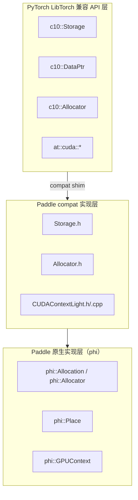
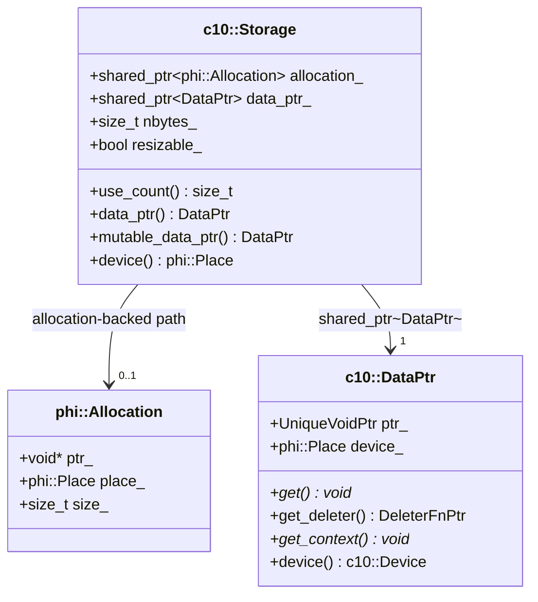
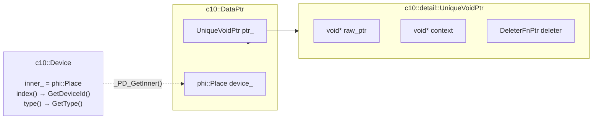
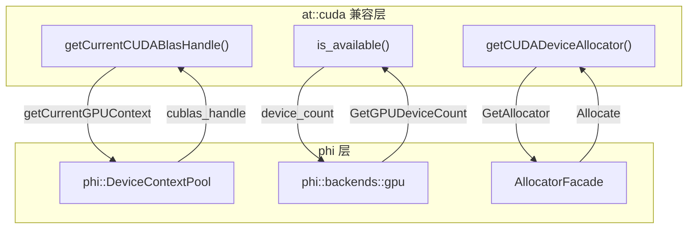

# Paddle compat 层兼容方式架构图

本文档说明 Paddle compat 层如何将 PyTorch 的 `c10::Storage` / `c10::DataPtr` 接口映射到 Paddle 内部实现。

---

## 整体分层架构



---

## c10::Storage 统一单路径架构

PyTorch 的 `StorageImpl` 使用单一 `DataPtr data_ptr_` 成员。Paddle compat 的 `Storage` 统一使用 `shared_ptr<DataPtr>` 作为共享所有权机制，同时保留 `allocation_` 成员用于 Paddle 原生路径的向后兼容：



### 架构说明

| 属性                | PyTorch StorageImpl              | Paddle compat Storage (统一设计)  |
|---------------------|----------------------------------|-----------------------------------|
| 数据所有权          | `DataPtr data_ptr_`（唯一来源）  | `shared_ptr<DataPtr> data_ptr_`   |
| allocation-backed   | 无（直接通过 DataPtr）           | `shared_ptr<phi::Allocation>`     |
| 设备信息来源        | `data_ptr_.device()`             | `allocation_->place()` 或 `data_ptr_->device()` |
| 引用计数来源        | `intrusive_ptr<StorageImpl>`     | `allocation_.use_count()` 或 `data_ptr_.use_count()` |
| copy-on-write       | 无（单一 StorageImpl）           | CoW 跳过带 deleter 的 DataPtr     |

### use_count() 计算依据

统一设计后，`use_count()` 的计算逻辑如下：

```cpp
size_t use_count() const {
    if (allocation_) return allocation_.use_count();
    if (data_ptr_ && *data_ptr_) return data_ptr_.use_count();
    return 0;
}
```

- **allocation-backed 路径**：返回 `allocation_.use_count()`，即共享 `phi::Allocation` 的 Storage 副本数
- **external DataPtr 路径**：返回 `data_ptr_.use_count()`，即共享 `shared_ptr<DataPtr>` 的 Storage 副本数
- **空 Storage**：默认构造时返回 0，与 PyTorch 空 `intrusive_ptr<StorageImpl>` 语义一致

### 单路径设计的优势

1. **语义正确性**：`data_ptr()` 返回的 `DataPtr` 直接包含原始 context 和 deleter，不再通过 wrapper 包装
2. **use_count 准确**：单个 Storage 的 `use_count()` 返回 1，拷贝后返回 2，符合预期
3. **简化实现**：移除 `external_ctx_` 成员和 `makeExternalDataPtr` wrapper，代码更清晰

---

## c10::DataPtr 与 phi::Place 的映射



---

## at::cuda 接口映射（CUDAContextLight）



### at::cuda::getCUDADeviceAllocator()

提供 Paddle CUDA Allocator 的 c10::Allocator 适配：

```cpp
c10::Allocator* getCUDADeviceAllocator() {
    static PaddleCUDAAllocatorAdapter adapter;
    return &adapter;
}
```

`PaddleCUDAAllocatorAdapter` 将 `phi::AllocatorFacade` 的 GPU 分配器包装为 `c10::Allocator` 接口，使得兼容层可以使用与 PyTorch 一致的内存分配方式。

---

## 注意事项

1. **CoW 机制**：调用 `mutable_data_ptr()` 时触发 `ensureUniqueDataPtr()`。对于不带 deleter 的 DataPtr，会创建新的 `shared_ptr<DataPtr>` 以实现 copy-on-write。对于带 deleter 的 DataPtr（外部 DataPtr 路径），CoW 被跳过以保留原始 deleter 和 context。

2. **默认构造 Storage**：`data_ptr_` 初始化为空 DataPtr，`*data_ptr_` 为 falsy，`use_count()` 返回 0，与 PyTorch 空 `intrusive_ptr<StorageImpl>` 的语义一致。

3. **多卡 device index 保留**：`phi::GPUPlace(n)` 的 device id 为 `n`，通过 `phi::Place::GetDeviceId()` 可完整读回，因此 `DataPtr::device().index()` 在多卡场景下返回正确值。

4. **统一单路径设计变更**：PR #78060 后续修改将 `external_ctx_` 和 `makeExternalDataPtr` wrapper 移除，直接通过 `data_ptr_` 的引用计数管理 Storage 副本，确保 `use_count()` 和 `data_ptr().get_deleter()` 的语义与 PyTorch 一致。
