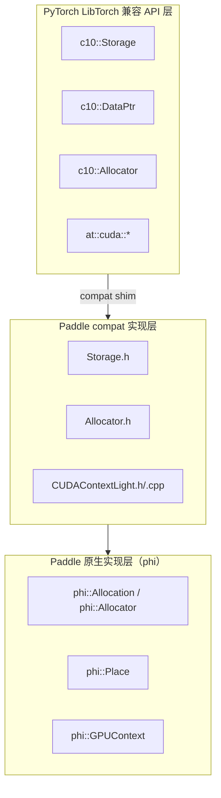
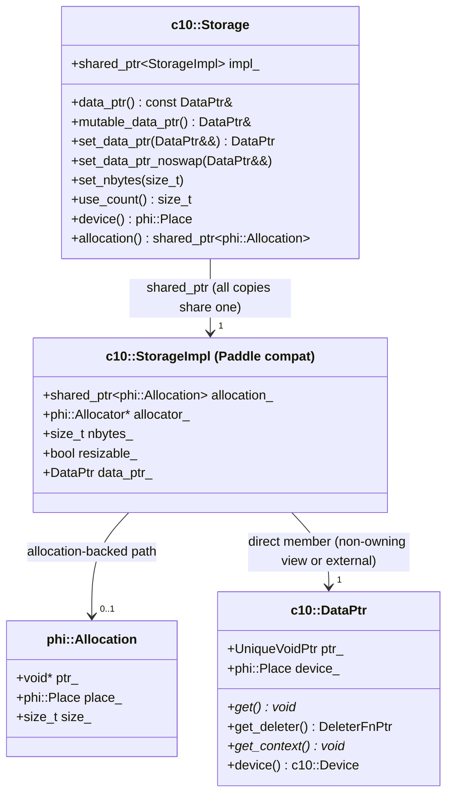
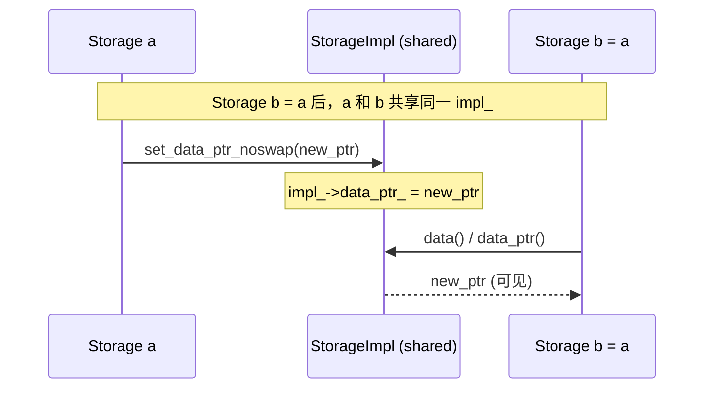
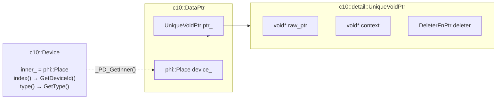
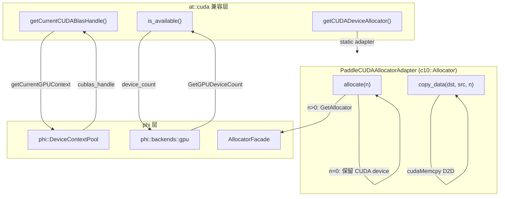

# Paddle compat 层兼容方式架构图

本文档说明 Paddle compat 层如何将 PyTorch 的 `c10::Storage` / `c10::DataPtr` 接口映射到 Paddle 内部实现。

---

## 整体分层架构



---

## c10::Storage 共享 StorageImpl 设计

Paddle compat 的 `Storage` 采用与 PyTorch 相同的 **shared handle** 设计：多个 `Storage` 副本共享同一个 `StorageImpl`，通过任意副本的 `set_data_ptr*()`/`set_nbytes()`/`mutable_data_ptr()` 写操作均对所有副本可见。



### 架构说明

| 属性 | PyTorch StorageImpl | Paddle compat StorageImpl |
|------|---------------------|---------------------------|
| Storage handle | `intrusive_ptr<StorageImpl>` | `shared_ptr<StorageImpl>` |
| 数据所有权 | `DataPtr data_ptr_`（直接成员） | `DataPtr data_ptr_`（直接成员，与 PyTorch 相同） |
| allocation-backed | 无（直接通过 DataPtr） | `shared_ptr<phi::Allocation>`（额外保存） |
| DataPtr 视图 | 由 Allocator 的 deleter 管理 | 对 phi::Allocation：非拥有性原始指针视图；外部 DataPtr：直接存储 |
| 设备信息来源 | `data_ptr_.device()` | `allocation_->place()` 或 `data_ptr_.device()` |
| 引用计数来源 | `intrusive_ptr` 计数 | allocation-backed: `allocation_.use_count()`；external DataPtr: `impl_.use_count()` |
| copy-on-write | 无（single StorageImpl） | 无（已移除 CoW；共享 impl_ 直接传播写操作） |

### use_count() 计算依据

```cpp
size_t use_count() const {
    if (!impl_) return 0;
    if (impl_->allocation_) return impl_->allocation_.use_count();
    if (impl_->data_ptr_)   return impl_.use_count();
    return 0;
}
```

- **allocation-backed 路径**：返回 `impl_->allocation_.use_count()`，即共享同一 `phi::Allocation` 的所有持有者数量（DenseTensor + Storage 副本等）
- **external DataPtr 路径**：返回 `impl_.use_count()`，即共享同一 `StorageImpl` 的 Storage handle 数量
- **空 Storage**：默认构造时返回 0，与 PyTorch 空 `intrusive_ptr<StorageImpl>` 语义一致

### Reference Semantics：写操作传播示意



---

## c10::DataPtr 与 phi::Place 的映射



---

## at::cuda 接口映射（CUDAContextLight）



### at::cuda::getCUDADeviceAllocator()

提供 Paddle CUDA Allocator 的 `c10::Allocator` 适配：

```cpp
c10::Allocator* getCUDADeviceAllocator() {
    static PaddleCUDAAllocatorAdapter adapter;
    return &adapter;
}
```

`PaddleCUDAAllocatorAdapter` 将 `phi::AllocatorFacade` 的 GPU 分配器包装为 `c10::Allocator` 接口：

| 方法 | 行为 |
|------|------|
| `allocate(0)` | 返回 `DataPtr(nullptr, nullptr, nullptr, Device(CUDA, current_device_id))`，保留当前 CUDA 设备信息，不触发实际分配 |
| `allocate(n>0)` | 通过 `AllocatorFacade` 在当前 GPU 上分配，所有权通过 `deletePaddleCUDAAllocation` deleter 管理 |
| `copy_data(dst, src, n)` | 使用 `cudaMemcpy(dst, src, n, cudaMemcpyDeviceToDevice)` 实现 GPU-to-GPU 拷贝，兼容 `c10::Allocator::clone()` 语义 |
| `raw_deleter()` | 返回 `nullptr`，表示 raw API 不可用。`c10::Allocator` raw 契约要求 `allocate(n)` 返回的 DataPtr 满足 `get()==get_context()`，但本实现中 `data=device_ptr`、`context=phi::Allocation*`，两者不等，因此不能宣称 raw API 可用（PR #78060 当轮修复）。 |

---

## 注意事项

1. **StorageImpl 共享设计**：`Storage b = a` 后两者共享同一个 `StorageImpl`。任何通过 a 或 b 的写操作（`set_data_ptr*`、`set_nbytes`、`mutable_data_ptr` 返回引用后修改）立即对另一方可见。这与 PyTorch 中 `Storage` 作为 `intrusive_ptr<StorageImpl>` handle 的语义一致。

2. **独立 Storage 互不影响**：`Storage a(alloc1); Storage b(alloc2)` 各自持有独立的 `StorageImpl`，写操作不跨越 impl 边界。

   **TensorBase::storage() 引用语义**（PR #78060 当轮修复）：`TensorBase::storage()` 现在会缓存对应 `StorageImpl`，同一 tensor 的多次调用返回共享同一 `StorageImpl` 的 handle，与 PyTorch 中 `TensorBase::storage()` 返回同一底层 `storage_` 成员 handle 的语义一致：

   ```cpp
   at::TensorBase tensor = at::ones({2, 3});
   c10::Storage s1 = tensor.storage();
   c10::Storage s2 = tensor.storage();  // s1 和 s2 共享同一 StorageImpl
   s1.set_data_ptr_noswap(new_alloc);
   assert(s2.data() == s1.data());  // ✅ 修改对 s2 可见
   ```

   缓存实现通过 `mutable std::shared_ptr<phi::Allocation> storage_holder_cache_` + `mutable c10::Storage cached_storage_` 实现，当 `DenseTensor::Holder()` 变化时自动失效（Holder 更换说明底层 allocation 已被重置）。

3. **phi::Allocation DataPtr 视图**：allocation-backed 路径中，`impl_->data_ptr_` 是对 `phi::Allocation` 的非拥有性视图（只含原始指针 + device，无 deleter），引用计数由 `impl_->allocation_` 独立维护，`use_count()` 不会因 DataPtr 的存在而虚增。

4. **多卡 device index 保留**：`phi::GPUPlace(n)` 的 device id 为 `n`，通过 `phi::Place::GetDeviceId()` 可完整读回，因此 `DataPtr::device().index()` 在多卡场景下返回正确值。
